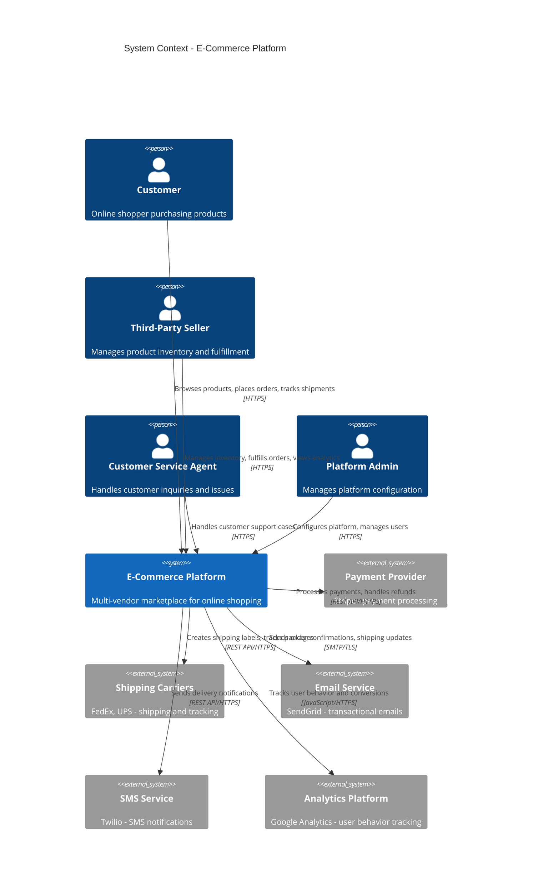
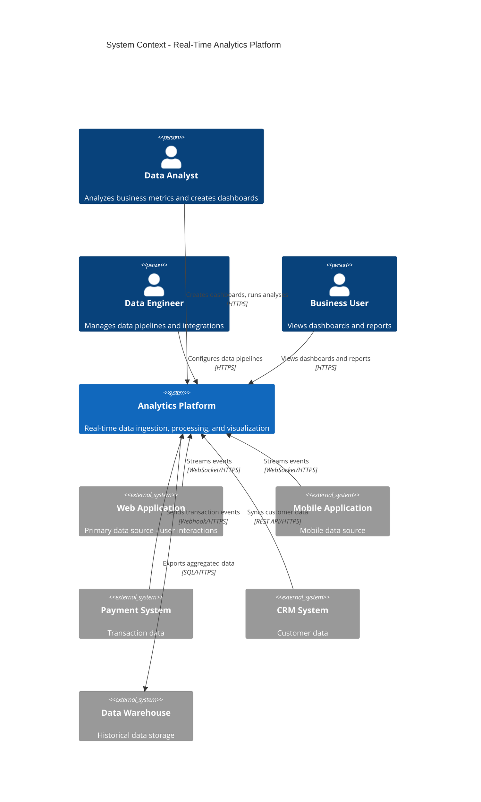
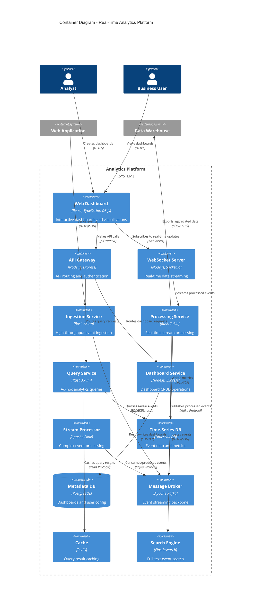

# Complete C4 Examples

## Overview

This resource provides full, production-ready C4 diagram sets for real-world systems. Each example includes all four C4 levels (where applicable) and demonstrates best practices for comprehensive architecture documentation.

## Example 1: Modern E-Commerce Platform

### System Context Diagram

**Use Case**: Show the e-commerce platform in its business context



### Container Diagram

**Use Case**: Show the technical architecture and technology choices

```mermaid
C4Container
  title Container Diagram - E-Commerce Platform

  Person(customer, "Customer")
  Person(seller, "Seller")

  System_Boundary(platform, "E-Commerce Platform") {
    Container(customer_web, "Customer Web App", "Next.js, React, TypeScript", "Shopping interface with SSR")
    Container(seller_portal, "Seller Portal", "React, TypeScript, Vite", "Inventory and order management SPA")
    Container(admin_panel, "Admin Panel", "React, TypeScript", "Platform administration")

    Container(cdn, "CDN", "CloudFlare", "Static asset delivery")

    Container(api_gateway, "API Gateway", "Kong", "API routing, rate limiting, authentication")

    Container(user_svc, "User Service", "Node.js, Express, TypeScript", "User accounts and authentication")
    Container(catalog_svc, "Catalog Service", "Rust, Axum", "Product catalog and search")
    Container(order_svc, "Order Service", "Node.js, Express, TypeScript", "Order processing and management")
    Container(payment_svc, "Payment Service", "Node.js, Express, TypeScript", "Payment processing")
    Container(inventory_svc, "Inventory Service", "Rust, Axum", "Inventory tracking")
    Container(notification_svc, "Notification Service", "Node.js, Express", "Email/SMS notifications")

    ContainerDb(user_db, "User Database", "PostgreSQL 15", "User and authentication data")
    ContainerDb(catalog_db, "Catalog Database", "PostgreSQL 15", "Product catalog")
    ContainerDb(order_db, "Order Database", "PostgreSQL 15", "Orders and transactions")
    ContainerDb(inventory_db, "Inventory Database", "PostgreSQL 15", "Inventory levels")

    Container(search_engine, "Search Engine", "Elasticsearch", "Product search and filtering")
    Container(cache, "Cache", "Redis Cluster", "Session and data caching")
    Container(message_broker, "Message Broker", "RabbitMQ", "Async event messaging")
    Container(object_storage, "Object Storage", "AWS S3", "Product images and documents")
  }

  System_Ext(payment_provider, "Payment Provider", "Stripe")
  System_Ext(shipping_api, "Shipping API", "FedEx")
  System_Ext(email_service, "Email Service", "SendGrid")

  Rel(customer, cdn, "Accesses", "HTTPS")
  Rel(seller, seller_portal, "Uses", "HTTPS")

  Rel(cdn, customer_web, "Delivers")

  Rel(customer_web, api_gateway, "Makes API calls", "JSON/REST, HTTPS")
  Rel(seller_portal, api_gateway, "Makes API calls", "JSON/REST, HTTPS")
  Rel(admin_panel, api_gateway, "Makes API calls", "JSON/REST, HTTPS")

  Rel(api_gateway, user_svc, "Routes authentication requests")
  Rel(api_gateway, catalog_svc, "Routes catalog requests")
  Rel(api_gateway, order_svc, "Routes order requests")
  Rel(api_gateway, payment_svc, "Routes payment requests")
  Rel(api_gateway, inventory_svc, "Routes inventory requests")

  Rel(user_svc, user_db, "Reads/writes", "SQL/TCP")
  Rel(catalog_svc, catalog_db, "Reads/writes", "SQL/TCP")
  Rel(order_svc, order_db, "Reads/writes", "SQL/TCP")
  Rel(inventory_svc, inventory_db, "Reads/writes", "SQL/TCP")

  Rel(catalog_svc, search_engine, "Indexes products", "HTTP/JSON")
  Rel(user_svc, cache, "Caches sessions", "Redis Protocol")
  Rel(catalog_svc, cache, "Caches product data", "Redis Protocol")

  Rel(catalog_svc, object_storage, "Stores/retrieves images", "S3 API/HTTPS")

  Rel(order_svc, message_broker, "Publishes OrderCreated, OrderUpdated", "AMQP")
  Rel(payment_svc, message_broker, "Subscribes to OrderCreated", "AMQP")
  Rel(inventory_svc, message_broker, "Subscribes to OrderCreated", "AMQP")
  Rel(notification_svc, message_broker, "Subscribes to OrderCreated, OrderUpdated", "AMQP")

  Rel(payment_svc, payment_provider, "Processes payments", "REST API/HTTPS")
  Rel(order_svc, shipping_api, "Creates labels, tracks", "REST API/HTTPS")
  Rel(notification_svc, email_service, "Sends emails", "SMTP/TLS")
```



### Component Diagram: Order Service

**Use Case**: Detail the internal structure of the Order Service

```plantuml
@startuml order-service-components
!include https://raw.githubusercontent.com/plantuml-stdlib/C4-PlantUML/master/C4_Component.puml

LAYOUT_WITH_LEGEND()

title Component Diagram - Order Service

Container(customer_web, "Customer Web App", "Next.js, React")
Container(seller_portal, "Seller Portal", "React")
ContainerDb(order_db, "Order Database", "PostgreSQL")
Container(message_broker, "Message Broker", "RabbitMQ")
System_Ext(payment_svc, "Payment Service")
System_Ext(shipping_api, "Shipping API")

Container_Boundary(order_service, "Order Service") {
    ' API Layer
    Component(api_routes, "API Routes", "Express Router", "HTTP route definitions")
    Component(order_controller, "Order Controller", "Controller Class", "Order CRUD operations")
    Component(checkout_controller, "Checkout Controller", "Controller Class", "Checkout flow handling")
    Component(auth_middleware, "Auth Middleware", "Express Middleware", "JWT authentication")
    Component(validation_middleware, "Validation Middleware", "Zod Schemas", "Request validation")

    ' Service Layer
    Component(order_service_comp, "Order Service", "Service Class", "Order business logic")
    Component(checkout_service, "Checkout Service", "Service Class", "Checkout orchestration")
    Component(fulfillment_service, "Fulfillment Service", "Service Class", "Order fulfillment")

    ' Repository Layer
    Component(order_repo, "Order Repository", "Repository Class", "Order data access")
    Component(order_item_repo, "OrderItem Repository", "Repository Class", "Order items data access")

    ' Event Publishing
    Component(event_publisher, "Event Publisher", "Class", "Publishes domain events")

    ' External Integration
    Component(shipping_client, "Shipping API Client", "HTTP Client", "Shipping integration")
}

Rel(customer_web, api_routes, "POST /orders, GET /orders/:id", "JSON/HTTPS")
Rel(seller_portal, api_routes, "GET /orders, PATCH /orders/:id", "JSON/HTTPS")

Rel(api_routes, auth_middleware, "Authenticates via")
Rel(auth_middleware, validation_middleware, "Validates via")
Rel(validation_middleware, order_controller, "Routes to")
Rel(validation_middleware, checkout_controller, "Routes to")

Rel(order_controller, order_service_comp, "Uses")
Rel(checkout_controller, checkout_service, "Uses")
Rel(order_controller, fulfillment_service, "Uses")

Rel(order_service_comp, order_repo, "Uses")
Rel(order_service_comp, event_publisher, "Publishes events via")
Rel(checkout_service, order_service_comp, "Uses")
Rel(checkout_service, event_publisher, "Publishes events via")
Rel(fulfillment_service, order_repo, "Uses")
Rel(fulfillment_service, shipping_client, "Creates labels via")

Rel(order_repo, order_db, "Reads/writes orders", "SQL/TCP")
Rel(order_item_repo, order_db, "Reads/writes order items", "SQL/TCP")
Rel(event_publisher, message_broker, "Publishes OrderCreated, OrderUpdated", "AMQP")
Rel(shipping_client, shipping_api, "Creates shipping labels", "REST API/HTTPS")

@enduml
```

## Example 2: Healthcare Management System

### System Context Diagram

```plantuml
@startuml healthcare-context
!include https://raw.githubusercontent.com/plantuml-stdlib/C4-PlantUML/master/C4_Context.puml

LAYOUT_WITH_LEGEND()

title System Context - Healthcare Management System

Enterprise_Boundary(hospital, "Hospital Enterprise") {
    Person(doctor, "Doctor", "Diagnoses patients, prescribes treatments")
    Person(nurse, "Nurse", "Administers care, updates patient records")
    Person(receptionist, "Receptionist", "Schedules appointments, manages registration")
    Person(pharmacist, "Pharmacist", "Dispenses medications")
}

Person_Ext(patient, "Patient", "Receives medical care")

System(ehr, "Electronic Health Records System", "Manages patient records, appointments, prescriptions, and billing")

System_Ext(lab_system, "Laboratory Information System", "Manages lab orders and results")
System_Ext(imaging_system, "Radiology System", "PACS for medical imaging")
System_Ext(pharmacy_system, "External Pharmacy Network", "E-prescription network")
System_Ext(insurance_gateway, "Insurance Clearing House", "Insurance verification and claims")
System_Ext(hl7_interface, "HL7 Interface Engine", "Healthcare data exchange")

Rel(doctor, ehr, "Manages patient care, writes prescriptions", "HTTPS")
Rel(nurse, ehr, "Updates vitals, administers medications", "HTTPS")
Rel(receptionist, ehr, "Schedules appointments, registers patients", "HTTPS")
Rel(pharmacist, ehr, "Views prescriptions, records dispensing", "HTTPS")
Rel(patient, ehr, "Views records, books appointments, messages providers", "HTTPS")

Rel(ehr, lab_system, "Sends lab orders, retrieves results", "HL7 v2/MLLP")
Rel(ehr, imaging_system, "Orders studies, retrieves images", "HL7 v2/MLLP, DICOM")
Rel(ehr, pharmacy_system, "Sends e-prescriptions", "NCPDP SCRIPT")
Rel(ehr, insurance_gateway, "Verifies eligibility, submits claims", "X12 EDI/HTTPS")
Rel(ehr, hl7_interface, "Exchanges patient data", "HL7 FHIR/HTTPS")

@enduml
```

### Container Diagram

```plantuml
@startuml healthcare-container
!include https://raw.githubusercontent.com/plantuml-stdlib/C4-PlantUML/master/C4_Container.puml

LAYOUT_WITH_LEGEND()

title Container Diagram - Healthcare Management System

Person(doctor, "Doctor")
Person(patient, "Patient")

System_Boundary(ehr, "Electronic Health Records System") {
    Container(provider_web, "Provider Web App", "React, TypeScript", "Clinical workflow interface")
    Container(patient_portal, "Patient Portal", "React, TypeScript", "Patient self-service")
    Container(mobile_app, "Mobile App", "React Native", "Patient mobile access")

    Container(api_gateway, "API Gateway", "Node.js, Express", "API routing and FHIR facade")

    Container(patient_svc, "Patient Service", "Node.js, Express", "Patient demographics and registration")
    Container(clinical_svc, "Clinical Service", "Rust, Axum", "Clinical notes, orders, results")
    Container(scheduling_svc, "Scheduling Service", "Node.js, Express", "Appointment scheduling")
    Container(pharmacy_svc, "Pharmacy Service", "Node.js, Express", "E-prescription management")
    Container(billing_svc, "Billing Service", "Rust, Axum", "Billing and claims")

    ContainerDb(patient_db, "Patient Database", "PostgreSQL", "Patient demographics (encrypted)")
    ContainerDb(clinical_db, "Clinical Database", "PostgreSQL", "Clinical records (encrypted)")
    ContainerDb(scheduling_db, "Scheduling Database", "PostgreSQL", "Appointments and resources")
    ContainerDb(billing_db, "Billing Database", "PostgreSQL", "Charges and claims")

    Container(document_db, "Document Store", "MongoDB", "Clinical documents and images")
    Container(cache, "Cache", "Redis", "Session and frequently accessed data")
    Container(audit_log, "Audit Log", "Elasticsearch", "HIPAA audit trail")
    Container(message_queue, "Message Queue", "RabbitMQ", "Async messaging")
}

System_Ext(lab_system, "Lab System")
System_Ext(pharmacy_network, "Pharmacy Network")
System_Ext(insurance_gateway, "Insurance Gateway")

Rel(doctor, provider_web, "Uses", "HTTPS + MFA")
Rel(patient, patient_portal, "Uses", "HTTPS")
Rel(patient, mobile_app, "Uses", "HTTPS")

Rel(provider_web, api_gateway, "Makes API calls", "JSON/HTTPS")
Rel(patient_portal, api_gateway, "Makes API calls", "JSON/HTTPS")
Rel(mobile_app, api_gateway, "Makes API calls", "JSON/HTTPS")

Rel(api_gateway, patient_svc, "Routes patient requests")
Rel(api_gateway, clinical_svc, "Routes clinical requests")
Rel(api_gateway, scheduling_svc, "Routes scheduling requests")
Rel(api_gateway, pharmacy_svc, "Routes pharmacy requests")
Rel(api_gateway, billing_svc, "Routes billing requests")

Rel(patient_svc, patient_db, "Reads/writes (encrypted)", "SQL/TCP + TLS")
Rel(clinical_svc, clinical_db, "Reads/writes (encrypted)", "SQL/TCP + TLS")
Rel(scheduling_svc, scheduling_db, "Reads/writes", "SQL/TCP + TLS")
Rel(billing_svc, billing_db, "Reads/writes", "SQL/TCP + TLS")

Rel(clinical_svc, document_db, "Stores clinical documents", "MongoDB Protocol + TLS")
Rel(clinical_svc, cache, "Caches recent results", "Redis Protocol + TLS")

Rel(patient_svc, audit_log, "Logs all access", "HTTP/JSON")
Rel(clinical_svc, audit_log, "Logs all access", "HTTP/JSON")
Rel(pharmacy_svc, audit_log, "Logs all access", "HTTP/JSON")

Rel(clinical_svc, message_queue, "Publishes LabOrderCreated", "AMQP + TLS")
Rel(pharmacy_svc, message_queue, "Publishes PrescriptionCreated", "AMQP + TLS")
Rel(billing_svc, message_queue, "Subscribes to clinical events", "AMQP + TLS")

Rel(clinical_svc, lab_system, "Sends lab orders", "HL7 v2/MLLP + TLS")
Rel(pharmacy_svc, pharmacy_network, "Sends e-prescriptions", "NCPDP SCRIPT/HTTPS")
Rel(billing_svc, insurance_gateway, "Submits claims", "X12 EDI/HTTPS")

@enduml
```

## Example 3: Real-Time Analytics Platform

### System Context Diagram



### Container Diagram



## Key Patterns Demonstrated

### Pattern 1: Event-Driven Architecture
All examples show async event communication using message brokers (RabbitMQ, Kafka) with dashed lines.

### Pattern 2: API Gateway Pattern
Each system uses an API Gateway for routing, authentication, and rate limiting.

### Pattern 3: Database Per Service
Microservices have dedicated databases following the bounded context pattern.

### Pattern 4: Caching Strategy
Redis used for sessions, frequently accessed data, and query result caching.

### Pattern 5: External Integration
Clear separation of internal systems vs. external dependencies (System_Ext).

### Pattern 6: Security Layers
Healthcare example shows encryption, TLS, MFA, and audit logging.

## Documentation Recommendations

For each example, accompany with:

1. **Architecture Decision Records (ADRs)** - Why these choices?
2. **Deployment Diagrams** - How deployed to infrastructure?
3. **Data Flow Diagrams** - How data moves through system?
4. **Security Documentation** - Authentication, authorization, encryption
5. **API Documentation** - OpenAPI specs for each service
6. **Runbooks** - Operational procedures

## Related Resources

- [PlantUML C4 Templates](./plantuml-templates.md) - PlantUML syntax reference
- [Mermaid C4 Templates](./mermaid-templates.md) - Mermaid syntax reference
- [Diagramming Best Practices](./best-practices.md) - General guidance

---

**Resource Coverage**: Complete multi-level C4 examples for three domains
**Demonstrates**: All C4 levels, multiple diagram formats, real-world patterns
**Use**: Copy as templates for similar systems, adapt to your architecture
