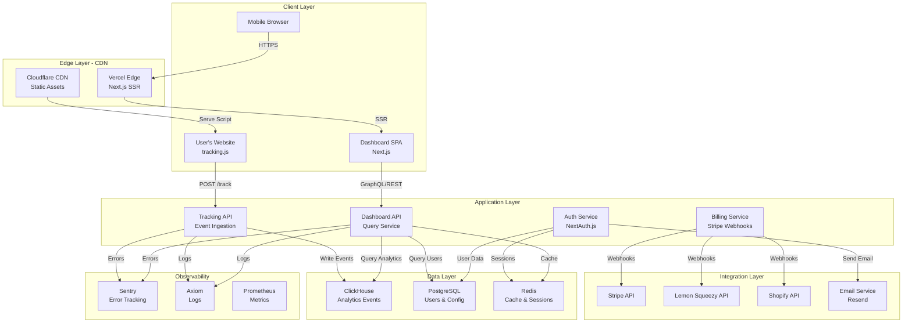
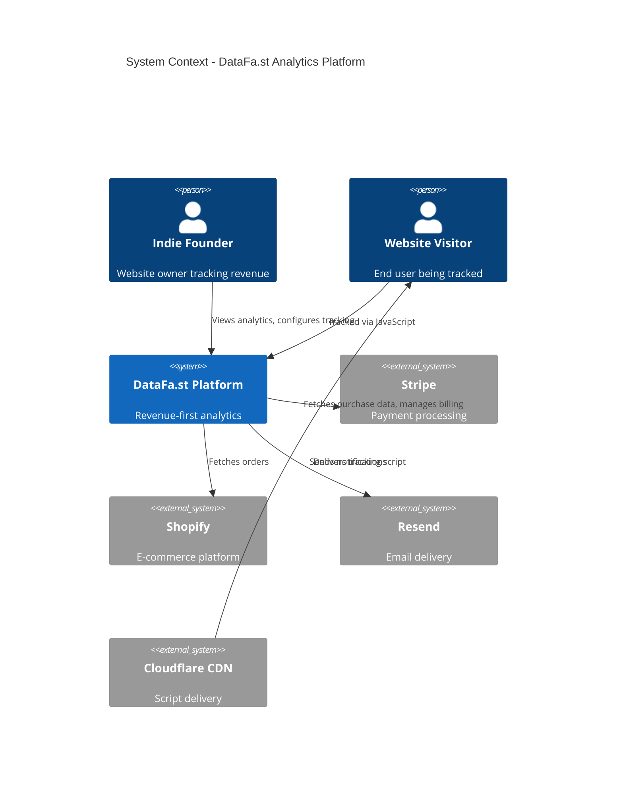
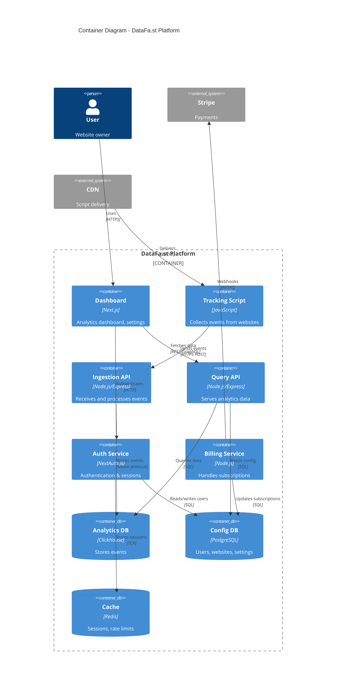
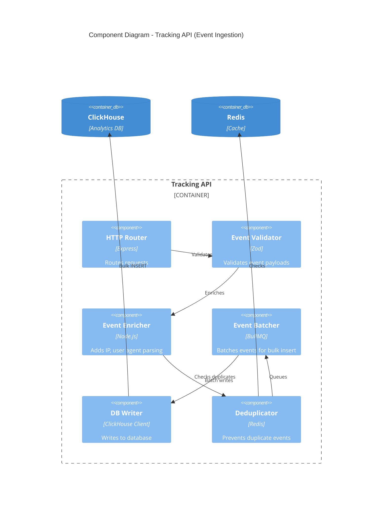
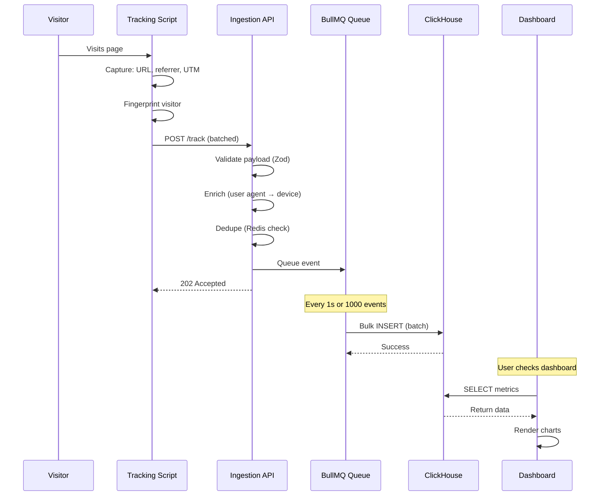
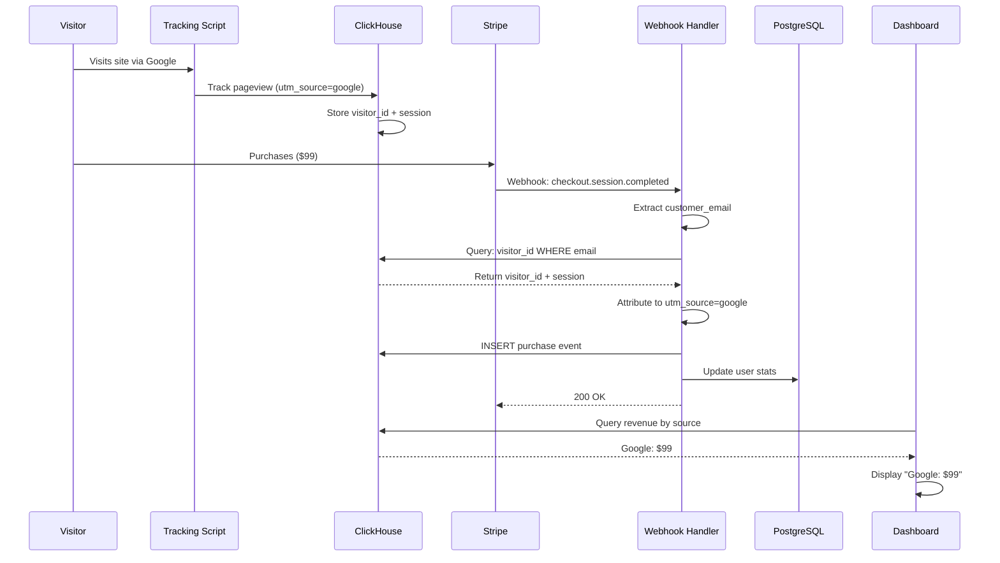
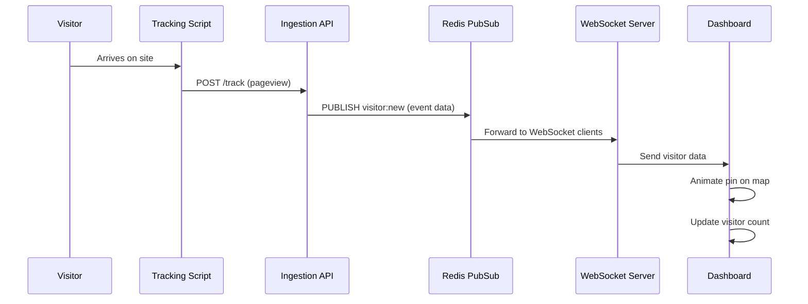

# DataFa.st System Architecture
## Technical Architecture & System Design

**Version:** 1.0
**Date:** November 18, 2025
**Status:** Draft

---

## Table of Contents
1. [System Overview](#1-system-overview)
2. [C4 Architecture Diagrams](#2-c4-architecture-diagrams)
3. [Component Details](#3-component-details)
4. [Data Flow](#4-data-flow)
5. [Infrastructure](#5-infrastructure)
6. [Security Architecture](#6-security-architecture)
7. [Scalability Strategy](#7-scalability-strategy)

---

## 1. System Overview

### High-Level Architecture



### System Boundaries

**Internal Systems (DataFa.st owned):**
- Tracking script (JavaScript)
- Dashboard frontend (Next.js)
- Tracking API (event ingestion)
- Dashboard API (queries)
- Authentication service
- Billing service

**External Systems (Third-party):**
- Stripe, Lemon Squeezy, Polar, Shopify (payment processors)
- Cloudflare/BunnyCDN (script delivery)
- Vercel (frontend hosting)
- Fly.io/Railway (backend hosting)
- Sentry, Axiom, Prometheus (observability)

---

## 2. C4 Architecture Diagrams

### Level 1: System Context



### Level 2: Container Diagram



### Level 3: Component Diagram (Tracking API)



---

## 3. Component Details

### 3.1 Tracking Script (tracking.js)

**Purpose:** Lightweight JavaScript library embedded on customer websites to collect analytics events.

**Responsibilities:**
- Auto-track pageviews (including SPA route changes)
- Capture UTM parameters and referrer
- Generate visitor fingerprint (canvas, fonts, user agent)
- Send events to ingestion API (batched)
- Queue events offline, retry on failure
- Expose public API: `window.datafast.goal(name, value)`

**Technology:**
- Vanilla JavaScript (ES6+)
- Build: Rollup + Terser + Brotli
- Size: <5KB compressed

**Key Files:**
```
tracking-script/
├── src/
│   ├── index.js              # Entry point
│   ├── tracker.js            # Core tracking logic
│   ├── fingerprint.js        # Visitor ID generation
│   ├── queue.js              # Offline queue + retry
│   ├── spa-detector.js       # SPA auto-tracking
│   └── api.js                # Public API (goal, etc.)
├── rollup.config.js          # Build config
├── package.json
└── dist/
    ├── datafast.min.js       # Production build
    └── datafast.min.js.br    # Brotli compressed
```

**API Surface:**
```javascript
// Auto-initialized on load
window.datafast = {
    // Track custom goal
    goal: (name, value) => void,

    // Track custom event
    track: (eventName, properties) => void,

    // Enable debug mode
    debug: (enabled) => void
};
```

---

### 3.2 Ingestion API (POST /track)

**Purpose:** High-throughput API to receive and process analytics events from tracking scripts.

**Responsibilities:**
- Validate event payloads (Zod schema)
- Enrich events (parse user agent, resolve IP to country)
- Deduplicate events (prevent double-counting)
- Batch events for bulk insert to ClickHouse
- Handle retries and errors gracefully

**Technology:**
- Runtime: Node.js 20+ or Bun
- Framework: Hono (lightweight, fast)
- Queue: BullMQ (Redis-backed)
- Validation: Zod

**Endpoints:**
```
POST /track
  Body: { website_id, event_type, page_url, referrer, utm_*, ... }
  Response: 202 Accepted { id: "evt_abc123" }
```

**Event Schema (Zod):**
```typescript
const EventSchema = z.object({
    website_id: z.string().uuid(),
    event_type: z.enum(['pageview', 'goal', 'purchase']),
    visitor_id: z.string().uuid(),
    session_id: z.string().uuid(),
    timestamp: z.number(),
    page_url: z.string().url(),
    referrer: z.string().url().optional(),
    utm_source: z.string().max(100).optional(),
    utm_medium: z.string().max(100).optional(),
    utm_campaign: z.string().max(200).optional(),
    device_type: z.enum(['mobile', 'desktop', 'tablet']),
    browser: z.string().max(50),
    os: z.string().max(50),
    country: z.string().length(2),
    revenue: z.number().optional(),
    goal_name: z.string().max(100).optional(),
});
```

**Processing Pipeline:**
```
Request → Validate → Enrich → Dedupe → Queue → Batch Insert → Response (202)
```

**Performance Targets:**
- Latency: <50ms (p95)
- Throughput: 10,000 events/second
- Batch size: 1,000 events per INSERT
- Batch interval: 1 second

---

### 3.3 Query API (GET /api/metrics, etc.)

**Purpose:** Serve aggregated analytics data to dashboard and API users.

**Responsibilities:**
- Query ClickHouse for metrics (visitors, revenue, RPV)
- Apply filters (date range, source, device)
- Cache frequently accessed data (Redis)
- Enforce rate limits (per-user quotas)
- Generate API responses (JSON)

**Technology:**
- Runtime: Node.js 20+
- Framework: Next.js API Routes
- ORM: Raw SQL (ClickHouse client), Prisma (PostgreSQL)
- Cache: Redis (Upstash)
- Rate Limit: Upstash Rate Limit

**Key Endpoints:**
```
GET /api/metrics?start_date=...&end_date=...
GET /api/visitors?start_date=...&limit=100&offset=0
GET /api/revenue?start_date=...&source=google
GET /api/goals?goal_name=signup
GET /api/funnels/:id
```

**Example Query (ClickHouse):**
```sql
-- Get metrics by source
SELECT
    utm_source,
    count(DISTINCT visitor_id) AS visitors,
    countIf(event_type = 'purchase') AS purchases,
    sum(revenue) AS total_revenue,
    total_revenue / visitors AS rpv
FROM events
WHERE website_id = :website_id
    AND timestamp >= :start_date
    AND timestamp <= :end_date
GROUP BY utm_source
ORDER BY total_revenue DESC;
```

**Caching Strategy:**
- Cache key: `metrics:{website_id}:{start_date}:{end_date}:{filters}`
- TTL: 5 minutes (balance freshness vs. load)
- Invalidation: On new data (webhook or polling)

---

### 3.4 Authentication Service (NextAuth.js)

**Purpose:** Manage user authentication, sessions, and authorization.

**Responsibilities:**
- OAuth login (Google, X/Twitter)
- Email/password login (bcrypt hashing)
- Session management (database sessions)
- Token generation (API keys)
- Password reset, email verification

**Technology:**
- NextAuth.js (OAuth + credentials)
- Prisma (PostgreSQL adapter)
- bcrypt (password hashing, 12 rounds)
- Upstash Rate Limit (prevent brute force)

**Session Storage:**
- Database sessions (PostgreSQL `sessions` table)
- HTTP-only cookies (SameSite=Lax, Secure)
- Expiry: 30 days

**Security Measures:**
- Rate limiting: 5 login attempts per 15 min
- CAPTCHA: Cloudflare Turnstile (after 3 failures)
- Password requirements: 8+ chars, 1 number
- Email verification: Required within 7 days

---

### 3.5 Billing Service (Stripe Webhooks)

**Purpose:** Handle subscription lifecycle events from Stripe.

**Responsibilities:**
- Process Stripe webhooks (subscription created, updated, canceled)
- Update user subscriptions in PostgreSQL
- Handle prorated billing (automatic via Stripe)
- Trigger events (email on trial ending, upgrade success)

**Technology:**
- Next.js API Route (`/api/webhooks/stripe`)
- Stripe SDK (Node.js)
- Webhook signature verification (HMAC)

**Webhook Events:**
```
customer.subscription.created    → Start subscription
customer.subscription.updated    → Plan change (upgrade/downgrade)
customer.subscription.deleted    → Cancellation
invoice.paid                     → Renewal success
invoice.payment_failed           → Payment failed (retry logic)
```

**Processing Flow:**
```
Stripe → Webhook → Verify Signature → Parse Event → Update DB → Send Email → Respond 200
```

---

## 4. Data Flow

### 4.1 Event Ingestion Flow



### 4.2 Revenue Attribution Flow



### 4.3 Real-Time Visitor Flow



---

## 5. Infrastructure

### 5.1 Deployment Architecture

```
┌─────────────────────────────────────────────┐
│  Cloudflare CDN                             │
│  - tracking.js (edge cached, Brotli)        │
│  - Static assets (images, fonts)            │
└─────────────────────────────────────────────┘
                  │
                  ▼
┌─────────────────────────────────────────────┐
│  Vercel Edge Network                        │
│  - Next.js frontend (SSR + ISR)             │
│  - API routes (serverless functions)        │
│  - Auto-scaling, zero config                │
└─────────────────────────────────────────────┘
                  │
                  ▼
┌─────────────────────────────────────────────┐
│  Backend Services (Fly.io / Railway)        │
│  - Ingestion API (Node.js, 2+ instances)    │
│  - WebSocket Server (separate process)      │
│  - Worker: Batch event processor            │
└─────────────────────────────────────────────┘
                  │
                  ▼
┌─────────────────────────────────────────────┐
│  Databases                                  │
│  - ClickHouse (single node → cluster)       │
│  - PostgreSQL (Supabase / RDS)              │
│  - Redis (Upstash, serverless)              │
└─────────────────────────────────────────────┘
```

### 5.2 Environment Setup

**Development:**
- Local Next.js dev server (`npm run dev`)
- Local ClickHouse (Docker)
- Local PostgreSQL (Docker)
- Local Redis (Docker)

**Staging:**
- Vercel preview deployments (PR-based)
- Shared ClickHouse instance
- Staging PostgreSQL database
- Staging Stripe (test mode)

**Production:**
- Vercel production deployment
- ClickHouse (managed or self-hosted)
- PostgreSQL (Supabase/RDS)
- Redis (Upstash)
- Stripe (live mode)

### 5.3 Scaling Strategy

**Phase 1: Single-Node (0-10K users)**
- Vercel: Auto-scales serverless functions
- ClickHouse: Single instance (8 CPU, 32 GB RAM)
- PostgreSQL: Small instance (2 CPU, 8 GB RAM)
- Cost: ~$200-300/month

**Phase 2: Vertical Scaling (10K-50K users)**
- ClickHouse: Upgrade to 16 CPU, 64 GB RAM
- PostgreSQL: Upgrade to 4 CPU, 16 GB RAM
- Add read replicas (PostgreSQL)
- Cost: ~$500-800/month

**Phase 3: Horizontal Scaling (50K+ users)**
- ClickHouse: Cluster with sharding + replication (3+ nodes)
- PostgreSQL: Primary + 2 read replicas
- Redis: Cluster mode
- Load balancer for ingestion API (multiple instances)
- Cost: ~$1,500-3,000/month

---

## 6. Security Architecture

### 6.1 Security Layers

**Application Security:**
- Input validation (Zod schemas)
- SQL injection prevention (parameterized queries)
- XSS prevention (React auto-escaping, CSP headers)
- CSRF protection (SameSite cookies)
- Rate limiting (per-IP, per-user)

**Authentication Security:**
- bcrypt password hashing (12 rounds)
- HTTP-only, Secure cookies
- OAuth 2.0 (Google, X)
- API token rotation (manual, future: automatic)
- Session expiry (30 days)

**Data Security:**
- TLS 1.3 (in transit)
- AES-256 (at rest, database encryption)
- IP anonymization (last octet hashed)
- No PII in ClickHouse (email hashed if needed)

**Infrastructure Security:**
- Firewall rules (allow only necessary ports)
- VPC/private networks (databases not public)
- Secrets management (Vercel env vars, AWS Secrets Manager)
- DDoS protection (Cloudflare)

### 6.2 Threat Model

| Threat | Mitigation |
|--------|------------|
| **DDoS on /track** | Cloudflare rate limiting, edge caching |
| **Credential stuffing** | Rate limiting, CAPTCHA, 2FA (future) |
| **SQL injection** | Parameterized queries, ORM (Prisma) |
| **XSS attacks** | React auto-escaping, CSP headers |
| **Data leaks** | Encryption at rest, access logs, RBAC |
| **API key theft** | HTTPS-only, key rotation, IP allowlist (optional) |

---

## 7. Scalability Strategy

### 7.1 Database Sharding (ClickHouse)

**When:** >100M events, >10K events/second

**Strategy:**
- Shard by `website_id` (each website's data on specific nodes)
- Replicate for high availability (3 replicas)
- Materialized views for common queries (pre-aggregation)

**Implementation:**
```sql
CREATE TABLE events_distributed AS events
ENGINE = Distributed(cluster, default, events, rand());

CREATE TABLE events ON CLUSTER cluster (
    event_id UUID,
    website_id UUID,
    ...
) ENGINE = ReplicatedMergeTree('/clickhouse/tables/{shard}/events', '{replica}')
PARTITION BY toYYYYMM(timestamp)
ORDER BY (website_id, timestamp);
```

### 7.2 API Caching

**Strategy:**
- CDN caching for public dashboards (Vercel Edge)
- Redis caching for authenticated APIs (5-minute TTL)
- Materialized views in ClickHouse (pre-aggregated metrics)

**Cache Hierarchy:**
```
Request → Vercel Edge Cache → Redis → ClickHouse (materialized view) → ClickHouse (raw)
```

### 7.3 Read Replicas

**When:** Dashboard queries slow down main database

**Strategy:**
- PostgreSQL: 1 primary + 2 read replicas (user queries)
- ClickHouse: Replicas for query distribution
- Load balancer distributes reads across replicas

---

## Summary

**Architecture Principles:**
- **Simplicity:** Use managed services where possible (Vercel, Upstash)
- **Performance:** Edge caching, batching, indexing
- **Scalability:** Vertical first, horizontal when needed
- **Reliability:** Replication, backups, monitoring
- **Security:** Defense in depth, least privilege

**Technology Choices:**
- **Frontend:** Next.js (React, TypeScript)
- **Backend:** Node.js/Bun, Hono, Express
- **Databases:** ClickHouse (events), PostgreSQL (config), Redis (cache)
- **Hosting:** Vercel (frontend), Fly.io/Railway (backend)
- **Observability:** Sentry, Axiom, Prometheus

**Next Steps:**
- Phase 0: Validate architecture with prototype
- Phase 1: Build MVP with single-node setup
- Phase 2: Scale vertically, add caching
- Phase 3: Horizontal scaling, distributed systems

---

**Document Status:** ✅ Ready for Review
**Last Updated:** November 18, 2025
