# DataFa.st User Flows
## Comprehensive User Journey Diagrams

**Version:** 1.0
**Date:** November 18, 2025
**Status:** Draft

---

## Table of Contents
1. [Onboarding Flow](#1-onboarding-flow)
2. [Daily Dashboard Check](#2-daily-dashboard-check)
3. [Goal and Funnel Setup](#3-goal-and-funnel-setup)
4. [Revenue Attribution Flow](#4-revenue-attribution-flow)
5. [Real-Time Visitor Monitoring](#5-real-time-visitor-monitoring)
6. [API Integration Flow](#6-api-integration-flow)
7. [Billing and Upgrade Flow](#7-billing-and-upgrade-flow)

---

## 1. Onboarding Flow
### Goal: User sees first revenue data within 5 minutes

```mermaid
flowchart TD
    Start[User Lands on Homepage] --> CTA{Clicks 'Add My Website'?}
    CTA -->|Yes| SignUp[Sign Up Page]
    CTA -->|No| Browse[Browse Marketing Content]

    SignUp --> AuthMethod{Choose Auth Method}
    AuthMethod -->|Email/Password| EmailSignUp[Enter Email & Password]
    AuthMethod -->|OAuth Google| GoogleOAuth[Redirect to Google]
    AuthMethod -->|OAuth X| XOAuth[Redirect to X/Twitter]

    EmailSignUp --> CreateAccount[Create Account]
    GoogleOAuth --> CreateAccount
    XOAuth --> CreateAccount

    CreateAccount --> VerifyEmail{Email Verified?}
    VerifyEmail -->|Email/Pass| SendVerification[Send Verification Email]
    VerifyEmail -->|OAuth| Skip[Skip - OAuth Verified]

    SendVerification --> CheckEmail[User Checks Email]
    CheckEmail --> ClickLink[Click Verification Link]
    ClickLink --> Dashboard[Redirect to Dashboard]
    Skip --> Dashboard

    Dashboard --> Checklist[Show Onboarding Checklist]
    Checklist --> Step1[Step 1: Add Website]

    Step1 --> EnterDomain[Enter Domain Name]
    EnterDomain --> ValidateDomain{Valid Domain?}
    ValidateDomain -->|No| DomainError[Error: Invalid Format]
    ValidateDomain -->|Yes| GenerateID[Generate Website ID]
    DomainError --> EnterDomain

    GenerateID --> Step2[Step 2: Install Script]
    Step2 --> ChooseMethod{Installation Method}

    ChooseMethod -->|HTML| CopyHTML[Copy Script Tag]
    ChooseMethod -->|Next.js| CopyNextJS[Copy Next.js Code]
    ChooseMethod -->|GTM| GTMInstructions[View GTM Instructions]
    ChooseMethod -->|Webflow| WebflowInstructions[View Webflow Instructions]

    CopyHTML --> PasteCode[User Pastes in Website]
    CopyNextJS --> PasteCode
    GTMInstructions --> PasteCode
    WebflowInstructions --> PasteCode

    PasteCode --> VerifyInstall[Click 'Verify Installation']
    VerifyInstall --> TestVisit[System Checks for Events]

    TestVisit --> EventDetected{Events Detected?}
    EventDetected -->|No| ShowDebug[Show Debug Instructions]
    EventDetected -->|Yes| InstallSuccess[✓ Installation Verified]

    ShowDebug --> CheckConsole[Check Browser Console]
    CheckConsole --> FixIssue[Fix Installation Issue]
    FixIssue --> VerifyInstall

    InstallSuccess --> Step3[Step 3: Connect Payment]
    Step3 --> ChooseProcessor{Payment Processor}

    ChooseProcessor -->|Stripe| ConnectStripe[Click 'Connect Stripe']
    ChooseProcessor -->|Skip for Now| SkipPayment[Skip - Track Traffic Only]

    ConnectStripe --> StripeOAuth[Stripe OAuth Flow]
    StripeOAuth --> GrantPermissions[Grant Permissions]
    GrantPermissions --> ValidateStripe{Valid Connection?}

    ValidateStripe -->|No| StripeError[Error: Check Permissions]
    ValidateStripe -->|Yes| StripeSuccess[✓ Stripe Connected]
    StripeError --> ConnectStripe

    StripeSuccess --> Step4[Step 4: View First Data]
    SkipPayment --> Step4

    Step4 --> WaitForData{Data Available?}
    WaitForData -->|No| SimulateVisit[Simulate Test Visit]
    WaitForData -->|Yes| ShowMetrics[Display Metrics]

    SimulateVisit --> ShowMetrics
    ShowMetrics --> OnboardingComplete[🎉 Onboarding Complete!]
    OnboardingComplete --> TrialStarts[14-Day Trial Starts]

    TrialStarts --> End[User Explores Dashboard]
```

**Key Decision Points:**
- **Auth Method:** OAuth is faster (no email verification)
- **Installation Method:** GTM/Webflow for non-technical users
- **Payment Connection:** Optional for MVP (can skip, track traffic only)

**Pain Points & Mitigations:**
- **Installation Errors:** Debug mode shows console logs, troubleshooting guide
- **Stripe Connection Fails:** Clear error messages, link to permissions guide
- **No Data Showing:** Simulate test visit, check event ingestion

---

## 2. Daily Dashboard Check
### Goal: User reviews key metrics in <2 minutes

```mermaid
flowchart TD
    Start[User Logs In] --> LoadDashboard[Dashboard Loads]
    LoadDashboard --> ViewMetrics[View Key Metrics]

    ViewMetrics --> CheckCards[Review Metric Cards]
    CheckCards --> Visitors[Visitors: 1,245]
    CheckCards --> Revenue[Revenue: $2,450]
    CheckCards --> RPV[RPV: $1.97]
    CheckCards --> ConvRate[Conv. Rate: 2.3%]

    Visitors --> Trend{Trend Indicator}
    Revenue --> Trend
    RPV --> Trend
    ConvRate --> Trend

    Trend -->|↑ Increase| Positive[Green Arrow - Good!]
    Trend -->|↓ Decrease| Negative[Red Arrow - Investigate]
    Trend -->|→ Flat| Neutral[Gray - Stable]

    Positive --> ChartReview[Review Line Chart]
    Negative --> Investigate[Drill Down - Filter by Source]
    Neutral --> ChartReview

    Investigate --> FilterSource[Select Traffic Source]
    FilterSource --> IdentifyIssue{Issue Found?}

    IdentifyIssue -->|Yes| AddNote[Add Note on Timeline]
    IdentifyIssue -->|No| CheckDevice[Filter by Device]

    AddNote --> NoteText[Type: 'Google Ads Campaign Paused']
    CheckDevice --> DeviceInsight[Mobile Traffic Down 40%]
    DeviceInsight --> AddNote

    NoteText --> SaveNote[Save Note]
    SaveNote --> ChartReview

    ChartReview --> ReferrerTable[Check Referrer Breakdown]
    ReferrerTable --> TopSources[View Top 5 Sources]

    TopSources --> Source1[1. Google: $800 - RPV $2.00]
    TopSources --> Source2[2. X Twitter: $600 - RPV $3.00]
    TopSources --> Source3[3. Direct: $500 - RPV $1.50]
    TopSources --> Source4[4. Facebook: $400 - RPV $0.80]
    TopSources --> Source5[5. LinkedIn: $150 - RPV $5.00]

    Source2 --> Insight[💡 X has highest RPV!]
    Insight --> Decision[Decision: Double Down on X]

    Decision --> QuickAction{Take Action?}
    QuickAction -->|Export Data| ExportCSV[Click 'Export CSV']
    QuickAction -->|Share| ShareDashboard[Copy Public Link]
    QuickAction -->|Done| Logout[Logout]

    ExportCSV --> Download[Download datafast-export-2025-11-18.csv]
    ShareDashboard --> CopyLink[Copy Link to Clipboard]

    Download --> Logout
    CopyLink --> Logout

    Logout --> End[Session Ends - Total Time: 90 seconds]
```

**Key Metrics Reviewed:**
- Visitors, Revenue, RPV, Conversion Rate
- Trend indicators (↑↓→)
- Referrer breakdown
- Top pages

**Actions Taken:**
- Add notes for anomalies
- Filter to identify issues
- Export data for deeper analysis
- Share dashboard with team

---

## 3. Goal and Funnel Setup
### Goal: Track custom conversions beyond revenue

```mermaid
flowchart TD
    Start[Navigate to Goals Page] --> ViewGoals{Existing Goals?}
    ViewGoals -->|No| EmptyState[Empty State: 'No goals yet']
    ViewGoals -->|Yes| GoalsList[List of Goals]

    EmptyState --> CreateFirst[Click 'Create First Goal']
    GoalsList --> CreateNew[Click '+ New Goal']

    CreateFirst --> GoalForm[Goal Creation Form]
    CreateNew --> GoalForm

    GoalForm --> GoalName[Enter Name: 'Newsletter Signup']
    GoalName --> TrackingMethod{Choose Tracking Method}

    TrackingMethod -->|Data Attribute| DataAttr[Use data-fast-goal='signup']
    TrackingMethod -->|JavaScript API| JSAPI[Use window.datafast.goal]

    DataAttr --> CodeExample1[Show Code Example]
    JSAPI --> CodeExample2[Show Code Example]

    CodeExample1 --> Code1[<button data-fast-goal='signup'>Subscribe</button>]
    CodeExample2 --> Code2[window.datafast.goal]

    Code1 --> OptionalValue{Add Monetary Value?}
    Code2 --> OptionalValue

    OptionalValue -->|Yes| SetValue[Set Value: $10 - Lead Value]
    OptionalValue -->|No| SkipValue[Skip - No Value]

    SetValue --> SaveGoal[Click 'Save Goal']
    SkipValue --> SaveGoal

    SaveGoal --> GoalCreated[✓ Goal Created]
    GoalCreated --> InstallCode[User Adds Code to Website]

    InstallCode --> TestGoal[Click 'Test Goal']
    TestGoal --> TriggerAction[User Triggers Goal on Site]

    TriggerAction --> EventReceived{Event Received?}
    EventReceived -->|No| DebugMode[Enable Debug Mode]
    EventReceived -->|Yes| GoalVerified[✓ Goal Verified]

    DebugMode --> CheckConsole[Check Console for Errors]
    CheckConsole --> FixCode[Fix Code Issue]
    FixCode --> TestGoal

    GoalVerified --> ViewDashboard[View Goal in Dashboard]
    ViewDashboard --> GoalMetrics[Metrics: 45 Completions - 3.2% Conv.]

    GoalMetrics --> CreateFunnel{Create Funnel?}
    CreateFunnel -->|Yes| FunnelBuilder[Navigate to Funnel Builder]
    CreateFunnel -->|No| Done[Done - Monitor Goal]

    FunnelBuilder --> SelectSteps[Select Funnel Steps]
    SelectSteps --> Step1[Step 1: Homepage]
    SelectSteps --> Step2[Step 2: Pricing Page]
    SelectSteps --> Step3[Step 3: Signup Goal]
    SelectSteps --> Step4[Step 4: Purchase]

    Step4 --> TimeWindow{Choose Time Window}
    TimeWindow -->|1 Hour| Window1H[Users who complete in 1 hour]
    TimeWindow -->|1 Day| Window1D[Users who complete in 1 day]
    TimeWindow -->|1 Week| Window1W[Users who complete in 1 week]

    Window1D --> CreateFunnelBtn[Click 'Create Funnel']
    CreateFunnelBtn --> FunnelViz[Funnel Visualization]

    FunnelViz --> FunnelData[1000 → 500 → 200 → 20]
    FunnelData --> DropOff[50% Drop-off at Step 2!]

    DropOff --> Analyze{Analyze Drop-off}
    Analyze -->|Filter by Device| DeviceBreakdown[Mobile: 70% drop-off]
    Analyze -->|Filter by Source| SourceBreakdown[Paid ads: 60% drop-off]

    DeviceBreakdown --> Insight[💡 Fix Mobile UX]
    SourceBreakdown --> Insight2[💡 Improve Ad Targeting]

    Insight --> SaveFunnel[Save Funnel for Future]
    Insight2 --> SaveFunnel

    SaveFunnel --> End[Funnel Monitoring Active]
```

**Goal Types:**
- Newsletter signup
- Demo request
- Free trial start
- Ebook download
- Webinar registration

**Funnel Configurations:**
- 2-5 steps
- Time windows: 1 hour, 1 day, 1 week
- Filters: device, source, country

---

## 4. Revenue Attribution Flow
### Goal: Connect purchases to traffic sources

**Attribution Logic:**
1. Match purchase email → visitor_id
2. Find most recent session within 30-day window
3. Attribute to that session's utm_source/referrer
4. Fallback to "Direct" if no match

**Edge Cases:**
- Multiple sessions → Most recent wins (last-click)
- Email mismatch → IP + fingerprint fallback
- Outside window → "Direct" attribution
- Subscription renewals → Don't re-attribute (credit original source)

---

## 5. Real-Time Visitor Monitoring
### Goal: Watch live visitors and engage high-value prospects

```mermaid
flowchart TD
    Start[User Opens Real-Time Tab] --> LoadMap[Load Globe/Map]
    LoadMap --> WebSocketConnect[Connect to Real-Time Feed]

    WebSocketConnect --> InitialLoad[Load Current Active Visitors]
    InitialLoad --> ShowCount[Active Visitors: 23]

    ShowCount --> MapPins[Display Visitor Pins on Map]
    MapPins --> Pin1[📍 New York - Desktop]
    MapPins --> Pin2[📍 London - Mobile]
    MapPins --> Pin3[📍 Tokyo - Tablet]

    Pin3 --> NewVisitor[🆕 New Visitor Arrives]
    NewVisitor --> AnimatePin[Pin Animates onto Map]
    AnimatePin --> UpdateCount[Active Visitors: 23 → 24]

    UpdateCount --> UserInteraction{User Clicks Pin?}
    UserInteraction -->|No| PollUpdate[Poll Every 5 Seconds]
    UserInteraction -->|Yes| ShowPopup[Show Visitor Details Popup]

    ShowPopup --> PopupData[Visitor Details]
    PopupData --> Location[📍 San Francisco, CA]
    PopupData --> CurrentPage[📄 Page: /pricing]
    PopupData --> Referrer[🔗 Referrer: google.com]
    PopupData --> Device[📱 Device: iPhone 14]
    PopupData --> Browser[🌐 Browser: Safari]
    PopupData --> SessionTime[⏱️ On Site: 2 min 34 sec]

    SessionTime --> GoalCheck{Completed Goal?}
    GoalCheck -->|No| NoGoal[No goals completed yet]
    GoalCheck -->|Yes| ShowGoal[✓ Completed: Newsletter Signup]

    ShowGoal --> HighlightVisitor[🌟 Highlight as High-Intent]
    NoGoal --> RegularVisitor[Regular Visitor]

    HighlightVisitor --> RevenueCheck{Generated Revenue?}
    RevenueCheck -->|No| PotentialCustomer[Potential Customer]
    RevenueCheck -->|Yes| PaidCustomer[💰 Paid: $99 - LTV: $99]

    PaidCustomer --> HighValueAlert[🔔 High-Value Visitor Alert]
    HighValueAlert --> AlertOptions{Alert Method}

    AlertOptions -->|In-App| InAppNotif[In-App Notification Shown]
    AlertOptions -->|Email| EmailAlert[Email Sent to user@example.com]
    AlertOptions -->|Webhook| WebhookFire[Webhook to Slack]

    WebhookFire --> SlackMessage[Slack: 'High-LTV visitor on /pricing!']
    SlackMessage --> TeamAction[Team Member Opens Chat]

    TeamAction --> EngageVisitor[Proactive Engagement via Intercom]
    EngageVisitor --> ClosePopup[Close Visitor Popup]

    ClosePopup --> ViewJourney{View Full Journey?}
    ViewJourney -->|Yes| JourneyTab[Click 'View Journey']
    ViewJourney -->|No| BackToMap[Back to Map View]

    JourneyTab --> JourneyList[Session Journey]
    JourneyList --> Step1[10:00 - Homepage via Google]
    JourneyList --> Step2[10:05 - Pricing Page]
    JourneyList --> Step3[10:08 - Features Page]
    JourneyList --> Step4[10:10 - Pricing Page - Current]

    Step4 --> EntryPage[Entry Page: Homepage]
    EntryPage --> ExitPrediction[Predicted Exit: Likely to Purchase 65%]

    ExitPrediction --> BackToMap
    BackToMap --> PollUpdate

    PollUpdate --> NewData{New Visitor Activity?}
    NewData -->|Yes| UpdateMap[Update Map with New Pins]
    NewData -->|No| Continue[Continue Polling]

    UpdateMap --> NewVisitor
    Continue --> PollUpdate

    InAppNotif --> End[User Monitors Live Traffic]
    EmailAlert --> End
    RegularVisitor --> End
    PotentialCustomer --> End
```

**Real-Time Features:**
- Live visitor count
- Globe/map visualization
- Visitor details popup
- Session journey tracking
- High-value alerts

**Update Frequency:**
- WebSocket: Instant updates
- Polling fallback: Every 5 seconds

---

## 6. API Integration Flow
### Goal: Build custom automation with DataFa.st API

```mermaid
flowchart TD
    Start[User Wants Custom Dashboard] --> NavSettings[Navigate to Settings → API]
    NavSettings --> CreateToken[Click 'Create API Token']

    CreateToken --> TokenForm[Token Creation Form]
    TokenForm --> TokenName[Enter Name: 'My App Integration']
    TokenName --> TokenScopes{Select Scopes - Future}

    TokenScopes -->|MVP| ReadOnly[Read-Only - All Endpoints]
    TokenScopes -->|Future| ReadWrite[Read-Write - POST/DELETE]

    ReadOnly --> GenerateToken[Click 'Generate Token']
    GenerateToken --> ShowToken[Token Shown Once]

    ShowToken --> CopyToken[sk_live_abc123xyz789...]
    CopyToken --> WarningMessage[⚠️ Save now - Won't show again]

    WarningMessage --> UserCopies[User Copies to Clipboard]
    UserCopies --> StoreSecure[Store in Password Manager]

    StoreSecure --> TestAPI[Test API Call]
    TestAPI --> TerminalCommand[Open Terminal]

    TerminalCommand --> CurlCommand[curl Command]
    CurlCommand --> SetHeaders[Authorization: Bearer sk_live_...]
    SetHeaders --> GetMetrics[GET /v1/metrics?start_date=2025-11-01]

    GetMetrics --> SendRequest[Send Request]
    SendRequest --> APIResponse{Response Status}

    APIResponse -->|401 Unauthorized| InvalidToken[Error: Invalid Token]
    APIResponse -->|429 Rate Limit| RateLimited[Error: Too Many Requests]
    APIResponse -->|200 OK| Success[Success Response]

    InvalidToken --> CheckToken[Verify Token Copied Correctly]
    RateLimited --> Wait[Wait 60 Seconds]

    Wait --> SendRequest
    CheckToken --> SendRequest

    Success --> JSONResponse[JSON Data Received]
    JSONResponse --> ParseData[Parse Response]

    ParseData --> DataFields[Data Fields]
    DataFields --> Visitors[visitors: 5000]
    DataFields --> Revenue[revenue: 2500.00]
    DataFields --> RPV[rpv: 0.50]
    DataFields --> ConversionRate[conversion_rate: 0.02]

    ConversionRate --> BuildApp{Build Application}
    BuildApp -->|Python| PythonScript[Write Python Script]
    BuildApp -->|JavaScript| NodeScript[Write Node.js Script]
    BuildApp -->|Zapier| ZapierIntegration[Create Zapier Workflow]

    PythonScript --> CodeExample1[import requests]
    NodeScript --> CodeExample2[const axios = require]
    ZapierIntegration --> CodeExample3[HTTP Request Action]

    CodeExample3 --> ZapierSetup[Zapier Setup]
    ZapierSetup --> Trigger[Trigger: Schedule - Every Day 9 AM]
    Trigger --> Action[Action: HTTP Request to DataFa.st API]

    Action --> GetRevenue[GET /v1/revenue?start_date=yesterday]
    GetRevenue --> ParseZapier[Parse JSON in Zapier]

    ParseZapier --> CheckRevenue{Revenue > $500?}
    CheckRevenue -->|No| NoAlert[Do Nothing]
    CheckRevenue -->|Yes| SlackAlert[Send Slack Message]

    SlackAlert --> SlackChannel[Post to #revenue Channel]
    SlackChannel --> Message[🎉 Revenue yesterday: $650!]

    Message --> TestZap[Test Zap]
    TestZap --> ZapWorks{Works?}

    ZapWorks -->|No| DebugZap[Debug: Check Token & Endpoint]
    ZapWorks -->|Yes| EnableZap[Enable Zap]

    DebugZap --> TestZap
    EnableZap --> Automated[Automation Running]

    Automated --> MonitorUsage[Monitor API Usage]
    MonitorUsage --> CheckDashboard[Settings → API → Usage]

    CheckDashboard --> UsageStats[Usage Stats]
    UsageStats --> RequestsToday[Requests Today: 45 / 100]
    UsageStats --> RateLimit[Rate Limit: 100 req/min]
    UsageStats --> LastUsed[Last Used: 2 minutes ago]

    LastUsed --> NearLimit{Near Limit?}
    NearLimit -->|Yes > 80%| UpgradePrompt[Prompt to Upgrade Plan]
    NearLimit -->|No| ContinueUsing[Continue Using API]

    UpgradePrompt --> UpgradePlan[Upgrade to Growth: 500 req/min]
    UpgradePlan --> End[API Integration Complete]

    ContinueUsing --> End
    NoAlert --> End
```

**API Use Cases:**
- Custom dashboards (Retool, Grafana)
- Slack/Discord revenue alerts
- Zapier/Make automations
- Data warehouse exports (BigQuery, Snowflake)
- Internal reporting tools

**Authentication:**
- Bearer token in Authorization header
- Token shown once on creation
- Stored hashed in database

**Rate Limits:**
- Starter: 100 req/min
- Growth: 500 req/min
- Enterprise: Custom

---

## 7. Billing and Upgrade Flow
### Goal: Seamless plan upgrade when hitting limits

**Billing Features:**
- Event usage counter
- Email alerts at 80%, 90%, 100%
- Auto-upgrade option (optional)
- Prorated billing (Stripe handles)
- Stripe Customer Portal for self-service

**Upgrade Triggers:**
- Manual: User clicks "Upgrade"
- Automatic: Enable auto-upgrade setting
- Support: User emails support for custom plan

---

## Summary

**Total User Flows:** 7
**Key Journeys:**
1. **Onboarding:** 5-minute setup from signup to first data
2. **Daily Check:** 2-minute metric review
3. **Goals:** Custom conversion tracking
4. **Attribution:** Revenue linked to traffic sources
5. **Real-Time:** Live visitor monitoring
6. **API:** Custom integrations
7. **Billing:** Seamless upgrades

**Next Steps:**
- Validate flows with user testing
- Identify pain points in each journey
- Optimize for mobile experiences
- Add error recovery paths

---

**Document Status:** ✅ Ready for Review
**Last Updated:** November 18, 2025
