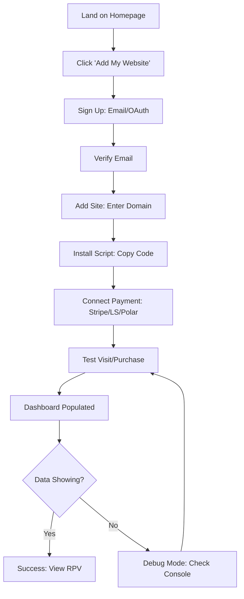
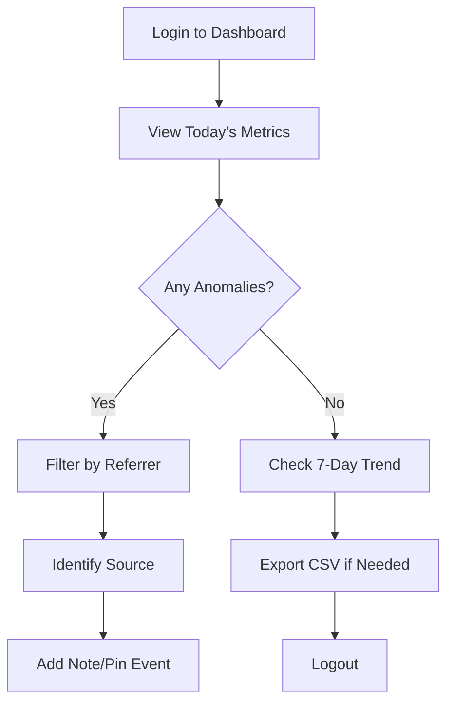
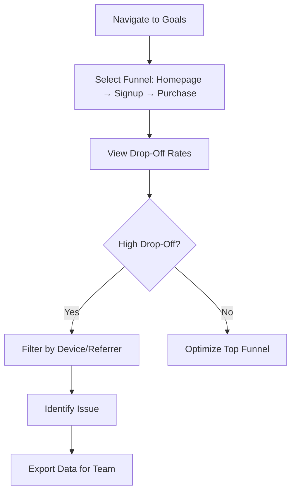

# Product Requirements Document: DataFa.st
## Revenue-First Web Analytics Platform

**Version:** 1.0
**Date:** November 18, 2025
**Status:** Draft
**Owner:** Product Team
**Stakeholders:** Engineering, Design, Marketing, Sales

---

## 1. Executive Summary

### Problem Statement
Entrepreneurs and small businesses struggle with traditional web analytics tools like Google Analytics that overwhelm them with vanity metrics (pageviews, bounce rates) while obscuring the one metric that matters most: **revenue**. Current solutions require 15+ minutes to set up, lack direct payment integration, and don't answer the critical question: "Which traffic sources actually generate revenue?"

**Evidence:**
- 75% of indie founders report GA is "too complex" for their needs (user research)
- Average setup time for GA is 15-20 minutes vs. 4-5 minutes for simpler alternatives
- Payment attribution requires manual UTM tracking and custom dashboard builds
- GDPR compliance adds additional complexity for bootstrapped teams

### Solution Overview
DataFa.st is a **revenue-first web analytics platform** that connects website traffic directly to revenue outcomes through native integrations with Stripe, Lemon Squeezy, Polar, and Shopify. The platform delivers actionable insights in under 5 minutes of setup, focusing on metrics that drive business decisions: Revenue Per Visitor (RPV), attribution by traffic source, and conversion funnels.

**Core Value Proposition:**
- **Fast Setup:** 4-5 minute onboarding vs. 15+ minutes for competitors
- **Revenue Attribution:** Direct connection to payment processors
- **Actionable Insights:** Focus on RPV, LTV, and conversion over vanity metrics
- **Privacy-First:** GDPR compliant, lightweight 4KB script
- **Real-Time Intelligence:** Live visitor maps and journey tracking

### Target Users
1. **Solo Founders/Indie Makers** (Primary): Bootstrapped entrepreneurs building SaaS, digital products, or e-commerce
2. **Small Business Owners** (Secondary): Teams of 2-10 managing online revenue
3. **Growth Marketers** (Tertiary): Performance marketers optimizing paid acquisition

### Business Objectives
- **Market Position:** Become the #1 analytics tool for indie makers and bootstrapped businesses
- **Revenue Target:** $50K MRR by end of Phase 1 (6 months)
- **User Growth:** Reach 15,000+ active users (from current 9,619)
- **Retention:** Achieve 85%+ monthly retention for paid users
- **Differentiation:** Establish "revenue-first" positioning vs. "privacy-first" (Plausible) or "enterprise" (Mixpanel)

### Success Metrics
| Metric | Current (Nov 2025) | Target (6 Months) |
|--------|-------------------|-------------------|
| Active Users | 9,619 | 15,000+ |
| MRR | ~$6K | $50K |
| Setup Time (Avg) | 4-5 min | <3 min |
| Trial → Paid Conversion | TBD | 18%+ |
| Monthly Retention | TBD | 85%+ |

### Strategic Alignment
This PRD supports the company's mission to **democratize revenue analytics** for makers and small businesses by removing complexity barriers and focusing on actionable, revenue-driving insights.

---

## 2. User Personas & Stories

### Persona 1: Sam the Solo SaaS Founder
**Demographics:**
- Age: 28-35
- Role: Founder/Developer
- Company: Bootstrapped SaaS (pre-$10K MRR)
- Tech Stack: Next.js, Stripe, Vercel

**Goals:**
- Understand which marketing channels drive revenue (not just traffic)
- Optimize limited ad spend ($500-2K/month)
- Make data-driven decisions in <5 minutes/day
- Stay GDPR compliant without legal team

**Pain Points:**
- Google Analytics is "overkill" with too many irrelevant metrics
- Manual UTM tracking is error-prone and time-consuming
- Can't see direct connection between Twitter post → revenue
- Afraid of GDPR fines but doesn't understand legal requirements

**Success Criteria:**
- Know which traffic source has highest RPV within 1 week
- Reduce time spent on analytics from 2 hours/week to 30 min/week
- Increase ROI on paid ads by 20%+ through better attribution

**User Story:**
> "As a solo founder, I want to see which of my X (Twitter) posts drive actual revenue, so I can double down on content that converts subscribers."

---

### Persona 2: Maria the E-Commerce Owner
**Demographics:**
- Age: 35-45
- Role: Business Owner (non-technical)
- Company: Online store (Shopify, 50-100 orders/month)
- Revenue: $20K-50K/month

**Goals:**
- Track revenue by traffic source (organic, social, ads)
- Understand customer journey from discovery to purchase
- Identify drop-off points in checkout funnel
- Prove ROI on influencer partnerships

**Pain Points:**
- Shopify analytics show sales but not attribution
- Relies on developer/agency for analytics setup
- Can't connect Instagram ad spend to actual revenue
- Overwhelmed by technical jargon in GA

**Success Criteria:**
- Self-service setup without developer help
- Clear visualization of funnel drop-offs
- Attribution for influencer referral codes
- Daily dashboard check in <2 minutes

**User Story:**
> "As an e-commerce owner, I want to see which Instagram influencer drives the most revenue per visitor, so I can negotiate better partnership terms."

---

### Persona 3: Alex the Growth Marketer
**Demographics:**
- Age: 26-32
- Role: Growth/Performance Marketer
- Company: Growing startup (5-person team, $50K+ MRR)
- Skills: Paid ads, SEO, conversion optimization

**Goals:**
- Optimize multi-channel campaigns (Google Ads, Meta, X)
- A/B test landing pages with revenue as primary metric
- Build custom reports for stakeholders
- Integrate analytics with existing tools (Slack, Notion)

**Pain Points:**
- GA4 attribution models don't match reality
- Switching between Stripe dashboard and analytics is inefficient
- Needs API access for custom integrations
- Team uses multiple tools (Mixpanel, Amplitude) creating data silos

**Success Criteria:**
- Single source of truth for revenue attribution
- API access for custom dashboards/automation
- Real-time alerts for high-value visitors
- Cross-domain tracking for multi-site funnels

**User Story:**
> "As a growth marketer, I want API access to revenue data, so I can build automated Slack alerts when high-LTV visitors are on site."

---

## 3. Functional Requirements

### Priority Framework
- **P0 (Must-Have):** Core functionality for MVP; blocking release
- **P1 (Should-Have):** Important for competitive positioning; Phase 1
- **P2 (Nice-to-Have):** Enhances UX but not critical; Phase 2+

---

### FR-1: Analytics Tracking Core
**Priority:** P0

**User Story:**
As a user, I want a lightweight tracking script that captures visitor behavior without slowing down my site, so I can maintain fast load times while gathering analytics.

**Acceptance Criteria:**
- [ ] Tracking script is <5KB compressed
- [ ] Script loads asynchronously (non-blocking)
- [ ] Page load time impact is <50ms (p95)
- [ ] Tracks pageviews, sessions, referrers, devices
- [ ] Works without cookies (GDPR compliant)
- [ ] Supports single-page apps (SPA) with auto-tracking
- [ ] Captures UTM parameters automatically
- [ ] Works across all modern browsers (Chrome, Firefox, Safari, Edge)

**Dependencies:** None (core foundation)

---

### FR-2: Revenue Attribution
**Priority:** P0

**User Story:**
As a founder, I want to connect my Stripe account, so I can see which traffic sources generate revenue without manual tagging.

**Acceptance Criteria:**
- [ ] Integration with Stripe (OAuth or API key)
- [ ] Integration with Lemon Squeezy
- [ ] Integration with Polar
- [ ] Integration with Shopify
- [ ] Automatic attribution of purchases to visitor sessions
- [ ] Display Revenue Per Visitor (RPV) by source
- [ ] Show Lifetime Value (LTV) by cohort
- [ ] Attribution window: 30 days default (configurable 1-90 days)
- [ ] Handle multiple purchases from same visitor
- [ ] Support subscription revenue (MRR calculation)

**Dependencies:** FR-1 (tracking must identify visitors)

---

### FR-3: Dashboard & Metrics
**Priority:** P0

**User Story:**
As a user, I want a simple dashboard showing revenue, visitors, and conversion rate, so I can understand business performance at a glance.

**Acceptance Criteria:**
- [ ] Display key metrics: Visitors, Revenue, RPV, Conversion Rate
- [ ] Time range filters: Today, 7d, 30d, 90d, Custom
- [ ] Breakdown by: Referrer, Device, Country, Browser
- [ ] Data refreshes in real-time (or <1 min delay)
- [ ] Export data to CSV
- [ ] Responsive design (mobile-friendly)
- [ ] Dark/light mode toggle
- [ ] Share dashboard publicly (optional)

**Dependencies:** FR-1, FR-2

---

### FR-4: Quick Setup Flow
**Priority:** P0

**User Story:**
As a non-technical user, I want to set up analytics in under 5 minutes, so I can start tracking revenue immediately without developer help.

**Acceptance Criteria:**
- [ ] Sign up with email/password or OAuth (Google, X)
- [ ] Add website: Enter domain, generate website ID
- [ ] Install script: One-click copy for HTML, Next.js, WordPress
- [ ] No-code options: Google Tag Manager, Webflow instructions
- [ ] Connect payment processor: OAuth or API key with validation
- [ ] Test mode: Verify tracking with sample visit/purchase
- [ ] Onboarding complete in <5 minutes (measured)
- [ ] Welcome email with setup checklist
- [ ] In-app tooltips for first-time users

**Dependencies:** None

---

### FR-5: Goals & Funnels
**Priority:** P1

**User Story:**
As a marketer, I want to track custom goals (signups, downloads) and visualize funnels, so I can identify conversion bottlenecks.

**Acceptance Criteria:**
- [ ] Create up to 10 custom goals per site
- [ ] Track goals via data attributes: `data-fast-goal="signup"`
- [ ] Track goals via JavaScript API: `window.datafast.goal('signup')`
- [ ] Funnel visualization: Multi-step with drop-off rates
- [ ] Goal-specific revenue attribution
- [ ] Conversion rate by traffic source
- [ ] Time-to-convert metrics (visit → goal completion)
- [ ] A/B test tracking (variant parameter)

**Dependencies:** FR-1

---

### FR-6: Real-Time Visitor Intelligence
**Priority:** P1

**User Story:**
As a founder, I want to see live visitors on a map, so I can watch my product going viral in real-time.

**Acceptance Criteria:**
- [ ] Globe/map visualization of active visitors
- [ ] Click visitor for details: Page, referrer, device, location
- [ ] Real-time counter (updates every 5-10 seconds)
- [ ] Filter by goal completion or revenue generated
- [ ] Show visitor journey (page flow in current session)
- [ ] API access for custom notifications
- [ ] Optional: Identify high-value visitors (>$X LTV)

**Dependencies:** FR-1, FR-2 (for revenue filtering)

---

### FR-7: X (Twitter) Attribution
**Priority:** P1

**User Story:**
As an indie maker, I want to see which of my tweets drive revenue, so I can optimize my X marketing strategy.

**Acceptance Criteria:**
- [ ] Add X handles to track (e.g., @marclouvion)
- [ ] Automatic detection of X referrers
- [ ] Show revenue per tweet (via URL tracking)
- [ ] Compare organic X vs. X Ads
- [ ] Display tweet text and engagement metrics (if API available)
- [ ] Support multiple X accounts (personal, brand)

**Dependencies:** FR-2

---

### FR-8: Custom API
**Priority:** P1

**User Story:**
As a developer, I want API access to analytics data, so I can build custom integrations and dashboards.

**Acceptance Criteria:**
- [ ] RESTful API with authentication (Bearer token)
- [ ] Endpoints: `/metrics`, `/visitors`, `/revenue`, `/goals`
- [ ] Query parameters: date range, filters, grouping
- [ ] Rate limiting: 100 requests/minute (adjustable by plan)
- [ ] Webhooks for events (new visitor, goal completion, purchase)
- [ ] API documentation with examples (Postman/OpenAPI)
- [ ] SDKs for Python, JavaScript (Phase 2)

**Dependencies:** FR-1, FR-2, FR-5

---

### FR-9: Multi-Site Management
**Priority:** P1

**User Story:**
As a growing business, I want to manage multiple websites from one dashboard, so I can compare performance across properties.

**Acceptance Criteria:**
- [ ] Add up to 30 sites (Growth plan)
- [ ] Starter plan: 1 site
- [ ] Site switcher in dashboard
- [ ] Aggregated view: Total revenue across all sites
- [ ] Cross-domain tracking (e.g., app.example.com → checkout.example.com)
- [ ] Separate API keys per site
- [ ] Team member permissions (Phase 2)

**Dependencies:** None

---

### FR-10: Event Limits & Billing
**Priority:** P0

**User Story:**
As a paying customer, I want clear visibility into my event usage, so I can upgrade before hitting limits.

**Acceptance Criteria:**
- [ ] Display current event count vs. plan limit
- [ ] Email alert at 80%, 90%, 100% of limit
- [ ] Overage handling: Pause tracking or auto-upgrade (user choice)
- [ ] Billing portal: Stripe Customer Portal integration
- [ ] Upgrade/downgrade in-app
- [ ] Prorated billing for mid-cycle changes
- [ ] 14-day free trial (no credit card required)
- [ ] Cancel anytime with data export

**Dependencies:** FR-1

---

### FR-11: Privacy & Compliance
**Priority:** P0

**User Story:**
As a European business owner, I want GDPR-compliant analytics, so I avoid legal risks without hiring a lawyer.

**Acceptance Criteria:**
- [ ] No cookies required (session tracking via localStorage/fingerprinting)
- [ ] IP anonymization (last octet hashed)
- [ ] Data processing agreement (DPA) available
- [ ] GDPR consent banner integration (optional)
- [ ] Right to erasure: Delete visitor data on request
- [ ] Data retention policy: 2 years default (configurable)
- [ ] Hosted in EU (optional regional data storage)
- [ ] Privacy policy and terms of service

**Dependencies:** None

---

### FR-12: Notes & Annotations
**Priority:** P2

**User Story:**
As a marketer, I want to add notes to my analytics (e.g., "launched ad campaign"), so I can correlate metrics with events.

**Acceptance Criteria:**
- [ ] Pin notes to specific dates on dashboard
- [ ] Add tags for categorization (campaign, product launch, etc.)
- [ ] Display notes as markers on charts
- [ ] Export notes with data
- [ ] Team-shared notes (if multi-user plan)

**Dependencies:** FR-3

---

### Out of Scope (Explicitly Not Included)
- ❌ Heatmaps or session recordings (use Hotjar/Microsoft Clarity instead)
- ❌ Marketing automation (email campaigns, retargeting)
- ❌ CRM features (customer profiles, support tickets)
- ❌ Social media scheduling or content management
- ❌ Built-in A/B testing (use data attributes for variant tracking only)
- ❌ Mobile app analytics (iOS/Android SDKs) – web only for MVP

---

## 4. Non-Functional Requirements

### NFR-1: Performance
**Priority:** P0

- **Page Load Impact:** Tracking script adds <50ms to page load (p95)
- **Script Size:** <5KB compressed
- **Dashboard Load Time:** <2 seconds (p95) for 30-day data
- **Real-Time Latency:** Visitor data updates within 10 seconds
- **API Response Time:** <500ms (p95) for standard queries
- **Database Queries:** Optimized for <100ms (p95) on indexed fields

**Measurement:** Lighthouse, Web Vitals, APM tools (Sentry, New Relic)

---

### NFR-2: Scalability
**Priority:** P1

- **Concurrent Users:** Support 1,000+ simultaneous dashboard users
- **Event Ingestion:** Handle 10K events/second peak load
- **Data Storage:** Efficiently store 100M+ events (2 years retention)
- **Multi-Tenancy:** Isolate data across 10K+ customer accounts
- **Database:** Horizontal scaling for time-series data (e.g., ClickHouse, TimescaleDB)

**Measurement:** Load testing (k6, Artillery), monitoring (Prometheus)

---

### NFR-3: Reliability
**Priority:** P0

- **Uptime:** 99.9% SLA (43 minutes downtime/month max)
- **Data Durability:** 99.999% (no data loss)
- **Backup & Recovery:** Daily backups, <4 hour RTO, <1 hour RPO
- **Error Handling:** Graceful degradation (script never breaks user's site)
- **Monitoring:** Uptime checks every 1 minute, incident alerts

**Measurement:** Status page, error tracking (Sentry), alerting (PagerDuty)

---

### NFR-4: Security
**Priority:** P0

- **Authentication:** OAuth 2.0 (Google, X), secure password hashing (bcrypt/Argon2)
- **Authorization:** Role-based access control (RBAC) for team plans
- **Data Encryption:** TLS 1.3 in transit, AES-256 at rest
- **API Security:** Rate limiting, API key rotation, IP allowlisting (optional)
- **Vulnerability Management:** Monthly security audits, dependency scanning (Dependabot)
- **OWASP Top 10:** Mitigation for XSS, CSRF, SQL injection, etc.

**Compliance:** GDPR (EU), CCPA (California), SOC 2 Type II (future)

---

### NFR-5: Usability
**Priority:** P0

- **Setup Time:** <5 minutes from sign-up to first data point
- **Mobile Responsive:** Dashboard works on phones/tablets (320px+ width)
- **Accessibility:** WCAG 2.1 AA compliant (keyboard nav, screen readers)
- **Browser Support:** Latest 2 versions of Chrome, Firefox, Safari, Edge
- **Localization:** English (Phase 1), add Spanish, French, German (Phase 2)
- **Help Resources:** In-app tooltips, documentation, video tutorials

**Measurement:** User testing, CSAT surveys, support ticket volume

---

### NFR-6: Maintainability
**Priority:** P1

- **Code Quality:** 80%+ test coverage, ESLint/Prettier enforced
- **Documentation:** API docs (OpenAPI), architecture diagrams (C4), ADRs
- **Deployment:** CI/CD with automated tests, blue-green deployments
- **Monitoring:** Centralized logging (ELK/Datadog), error tracking (Sentry)
- **Version Control:** Git, semantic versioning, changelog maintenance

---

## 5. Design & UX

### Design Principles
1. **Simplicity First:** Every metric must answer "does this drive revenue?"
2. **Speed Matters:** Fast loading, instant insights, no analysis paralysis
3. **Visual Clarity:** Clean charts, intuitive navigation, minimal cognitive load
4. **Mobile-Friendly:** Full feature parity on mobile devices
5. **Delightful Details:** Smooth animations, color schemes, real-time updates

### Key User Flows

#### Flow 1: Onboarding (Sign-Up to First Insight)
**Goal:** User sees first revenue data within 5 minutes



**Pain Points:**
- Script installation errors (mitigated by no-code options)
- Payment integration scope issues (clear error messages + docs)

**Optimizations:**
- Inline validation for domain format
- One-click test mode (simulate visit without real traffic)
- Progress bar showing completion (5 steps)

---

#### Flow 2: Daily Dashboard Check
**Goal:** User checks key metrics in <2 minutes



**Interactions:**
- Hover over chart for detailed tooltips
- Click referrer to drill down
- Pin notes on timeline

---

#### Flow 3: Goal Funnel Analysis
**Goal:** Identify drop-off points in conversion funnel



---

### Visual Design

**Color Schemes:**
- **Light Mode:** Clean whites, soft grays, accent blues
- **Dark Mode:** Deep blacks, dark grays, vibrant accent colors
- **Accessibility:** WCAG AA contrast ratios (4.5:1 text, 3:1 UI)

**Key UI Components:**
- **Metric Cards:** Large numbers with trend indicators (↑↓)
- **Line Charts:** Revenue/visitors over time with hover details
- **Globe Map:** Animated 3D globe with visitor pins
- **Funnel Diagrams:** Horizontal bars with percentage drop-offs
- **Data Tables:** Sortable, filterable, paginated (50 rows/page)

**Design Files:** Link to Figma (TBD – create in Design phase)

**Mockups:** See `/datafast/design/mockups/` (to be created)

---

## 6. Technical Specifications

### System Architecture

**High-Level Overview:**
```
┌─────────────┐      ┌──────────────┐      ┌─────────────┐
│ User Website│ ───> │ Tracking API │ ───> │  Database   │
│ (Script)    │      │ (Ingest)     │      │ (ClickHouse)│
└─────────────┘      └──────────────┘      └─────────────┘
                              │
                              ▼
                     ┌──────────────────┐
                     │ Attribution      │
                     │ Engine           │
                     └──────────────────┘
                              │
                              ▼
                     ┌──────────────────┐      ┌─────────────┐
                     │ Dashboard API    │ ───> │ Frontend    │
                     │ (Query)          │      │ (Next.js)   │
                     └──────────────────┘      └─────────────┘
                              │
                              ▼
                     ┌──────────────────┐
                     │ Payment          │
                     │ Integrations     │
                     │ (Stripe, etc.)   │
                     └──────────────────┘
```

---

### Technology Stack (Recommended)

**Frontend:**
- **Framework:** Next.js 14+ (React 18+, App Router)
- **Styling:** Tailwind CSS + shadcn/ui components
- **Charts:** Recharts or Chart.js
- **State:** React Query (TanStack Query)
- **Auth:** NextAuth.js or Clerk

**Backend:**
- **Runtime:** Node.js 20+ or Bun
- **Framework:** Express.js or Hono (lightweight)
- **Language:** TypeScript
- **API:** RESTful (GraphQL optional for Phase 2)

**Database:**
- **Analytics Data:** ClickHouse or TimescaleDB (time-series optimized)
- **User/Billing Data:** PostgreSQL (Supabase or RDS)
- **Session/Cache:** Redis (Upstash)

**Tracking Script:**
- **Language:** Vanilla JavaScript (ES6+), no dependencies
- **Build:** Minified + compressed (Terser, Brotli)
- **CDN:** Cloudflare or BunnyCDN

**Infrastructure:**
- **Hosting:** Vercel (frontend), Fly.io or Railway (backend)
- **CDN:** Cloudflare
- **Monitoring:** Sentry (errors), Axiom (logs), Prometheus (metrics)
- **CI/CD:** GitHub Actions

**Third-Party Services:**
- **Payments:** Stripe (billing), integrations for LS/Polar/Shopify
- **Email:** Resend or Loops
- **Auth:** OAuth providers (Google, X/Twitter)

---

### Data Models

#### Event Schema (ClickHouse)
```sql
CREATE TABLE events (
    event_id UUID,
    website_id UUID,
    visitor_id UUID,
    session_id UUID,
    event_type Enum('pageview', 'goal', 'purchase'),
    timestamp DateTime,
    page_url String,
    referrer String,
    utm_source Nullable(String),
    utm_medium Nullable(String),
    utm_campaign Nullable(String),
    device_type Enum('mobile', 'desktop', 'tablet'),
    browser String,
    os String,
    country String,
    revenue Nullable(Decimal(10,2)),
    goal_name Nullable(String)
) ENGINE = MergeTree()
PARTITION BY toYYYYMM(timestamp)
ORDER BY (website_id, timestamp);
```

#### User Schema (PostgreSQL)
```sql
CREATE TABLE users (
    user_id UUID PRIMARY KEY,
    email VARCHAR(255) UNIQUE NOT NULL,
    password_hash VARCHAR(255),
    oauth_provider VARCHAR(50),
    created_at TIMESTAMP DEFAULT NOW(),
    subscription_plan VARCHAR(50),
    subscription_status VARCHAR(50),
    stripe_customer_id VARCHAR(255)
);

CREATE TABLE websites (
    website_id UUID PRIMARY KEY,
    user_id UUID REFERENCES users(user_id),
    domain VARCHAR(255) NOT NULL,
    created_at TIMESTAMP DEFAULT NOW(),
    tracking_code TEXT,
    payment_integration JSONB
);
```

---

### API Endpoints

**Authentication:**
- `POST /auth/signup` - Create account
- `POST /auth/login` - Email/password login
- `GET /auth/oauth/google` - OAuth redirect
- `POST /auth/refresh` - Refresh token

**Analytics:**
- `POST /track` - Ingest event (public, used by script)
- `GET /api/metrics` - Query aggregated metrics
- `GET /api/visitors` - Real-time visitor list
- `GET /api/revenue` - Revenue breakdown
- `GET /api/goals` - Goal conversion data
- `GET /api/funnels` - Funnel analysis

**Admin:**
- `POST /api/websites` - Add website
- `GET /api/websites/:id` - Website details
- `PUT /api/websites/:id` - Update website
- `DELETE /api/websites/:id` - Delete website
- `GET /api/billing` - Billing info
- `POST /api/billing/upgrade` - Change plan

**Integrations:**
- `POST /api/integrations/stripe` - Connect Stripe
- `POST /api/integrations/lemon-squeezy` - Connect LS
- `GET /api/integrations/:provider/webhook` - Receive webhooks

**Rate Limits:**
- Public tracking endpoint: 1000 req/min per IP
- Authenticated APIs: 100 req/min per user
- Burst allowance: 2x sustained rate for 10 seconds

---

### Integrations

#### Stripe Integration
**Flow:**
1. User initiates OAuth or enters API key (restricted key)
2. Validate key with test API call
3. Create webhook endpoint: `https://datafa.st/api/integrations/stripe/webhook`
4. Subscribe to events: `checkout.session.completed`, `invoice.paid`
5. On webhook receipt, match `customer_email` or `customer_id` to visitor session
6. Attribute revenue to session's traffic source (30-day attribution window)

**Error Handling:**
- Invalid API key → Clear error message, link to Stripe docs
- Webhook signature mismatch → Log error, alert user
- Missing customer email → Fallback to IP/fingerprint matching (lower confidence)

---

#### Shopify Integration
**Flow:**
1. User installs Shopify app or enters API credentials
2. Request scopes: `read_orders`, `read_customers`
3. Fetch order data via Shopify API
4. Match orders to sessions via customer email or referrer URL
5. Handle subscription revenue: Recognize MRR, churn tracking

**Challenges:**
- Shopify order timing (async) → Use order created timestamp
- Multi-currency → Convert to user's preferred currency (USD default)

---

## 7. Success Metrics & KPIs

### North Star Metric
**Revenue Per User (RPU):** Average monthly revenue generated per active user

**Target:** $5.20/user (from $6K MRR / 9,619 users ≈ $0.62 → goal: $50K / 15K = $3.33)

---

### Product KPIs

| Category | Metric | Measurement | Target (6 Months) |
|----------|--------|-------------|-------------------|
| **Acquisition** | New Sign-Ups | Weekly count | 150/week |
| **Activation** | Setup Completion Rate | % who complete all setup steps | 80%+ |
| **Activation** | Time to First Data | Minutes from signup to first event | <5 min (avg) |
| **Engagement** | Daily Active Users (DAU) | Unique logins per day | 30% of total users |
| **Engagement** | Dashboard Views/User | Avg sessions per user per week | 3+ |
| **Retention** | Monthly Retention | % of users active month-over-month | 85%+ |
| **Retention** | Churn Rate | % of paid users canceling per month | <5% |
| **Revenue** | Trial → Paid Conversion | % of trial users upgrading | 18%+ |
| **Revenue** | MRR | Monthly recurring revenue | $50K |
| **Revenue** | ARPU | Average revenue per user | $3.33 |
| **Satisfaction** | NPS | Net Promoter Score | 50+ |
| **Satisfaction** | CSAT | Customer satisfaction (1-5) | 4.5+ |

---

### Feature-Specific Metrics

**FR-2 (Revenue Attribution):**
- % of users with payment integration connected: 70%+
- Accuracy of attribution (vs. self-reported): 90%+

**FR-5 (Goals & Funnels):**
- % of users with at least 1 goal set: 60%+
- Avg goals per user: 3+

**FR-6 (Real-Time Visitors):**
- % of users checking real-time view weekly: 40%+

**FR-8 (API):**
- API adoption rate (users making API calls): 10%+
- API errors per 1000 requests: <1%

---

### Measurement Methodology

**Tools:**
- **Product Analytics:** Self-hosted DataFa.st instance (dogfooding)
- **User Feedback:** In-app surveys (e.g., Formbricks), NPS via email
- **Revenue Tracking:** Stripe dashboard + custom billing analytics
- **Performance:** Vercel Analytics, Sentry performance monitoring
- **Support:** Ticket volume and resolution time (Plain.com)

**Cadence:**
- Daily: MRR, new sign-ups, churn
- Weekly: Retention cohorts, feature adoption
- Monthly: NPS, CSAT, product roadmap review

---

## 8. Release Plan & Roadmap

### Phased Rollout Strategy

#### Phase 0: Validation & Setup (Weeks 1-2)
**Goal:** Validate technical feasibility and gather user feedback on prototype

**Deliverables:**
- [ ] Technical spike: ClickHouse vs. TimescaleDB benchmarking
- [ ] Design mockups (Figma) for core dashboard
- [ ] MVP feature set finalized (FR-1 to FR-4 only)
- [ ] 10 beta user interviews (validate problem-solution fit)
- [ ] ADRs for tech stack decisions

**Success Criteria:**
- Beta users confirm <5 min setup time
- No major technical blockers identified
- Design approval from stakeholders

---

#### Phase 1: MVP Launch (Weeks 3-10)
**Goal:** Launch publicly with core revenue attribution features

**Features:**
- ✅ FR-1: Analytics Tracking Core
- ✅ FR-2: Revenue Attribution (Stripe only for MVP)
- ✅ FR-3: Dashboard & Metrics
- ✅ FR-4: Quick Setup Flow
- ✅ FR-10: Event Limits & Billing
- ✅ FR-11: Privacy & Compliance

**Milestones:**
- Week 3-4: Backend API + database setup
- Week 5-6: Tracking script + ingestion pipeline
- Week 7-8: Dashboard frontend + Stripe integration
- Week 9: Testing + bug fixes
- Week 10: Public launch

**Success Criteria:**
- 500 sign-ups in first month
- 18%+ trial → paid conversion
- <5% critical bugs reported
- 4.5+ CSAT from early users

**Risks:**
- Scaling issues with event ingestion → Mitigation: Load testing, auto-scaling
- Stripe integration errors → Mitigation: Sandbox testing, clear error messages

---

#### Phase 2: Growth Features (Weeks 11-18)
**Goal:** Add differentiating features to drive adoption

**Features:**
- ✅ FR-5: Goals & Funnels
- ✅ FR-6: Real-Time Visitor Intelligence
- ✅ FR-7: X (Twitter) Attribution
- ✅ FR-9: Multi-Site Management
- ✅ Add Lemon Squeezy, Polar, Shopify integrations

**Milestones:**
- Week 11-12: Goals & funnels backend + UI
- Week 13-14: Real-time map (WebSocket integration)
- Week 15-16: X attribution + additional payment integrations
- Week 17: Multi-site dashboard
- Week 18: QA + polish

**Success Criteria:**
- 2,000+ total users
- 60%+ users set at least 1 goal
- 40%+ check real-time view weekly
- NPS 50+

---

#### Phase 3: API & Advanced Features (Weeks 19-24)
**Goal:** Enable power users and custom integrations

**Features:**
- ✅ FR-8: Custom API
- ✅ FR-12: Notes & Annotations
- ✅ Team collaboration (multi-user accounts)
- ✅ Advanced filtering (segments, cohorts)

**Milestones:**
- Week 19-20: RESTful API + documentation
- Week 21: Webhooks for real-time events
- Week 22: Notes + team features
- Week 23-24: Testing + API SDKs (JS, Python)

**Success Criteria:**
- 10%+ of users adopt API
- 5% of revenue from Enterprise plan ($499/mo)
- API uptime 99.9%+

---

### Post-Launch Roadmap (6-12 Months)

**Q1 2026:**
- Mobile app analytics (iOS/Android SDKs)
- Advanced cohort analysis
- Slack/Discord/Telegram integrations for alerts
- Localization (Spanish, French, German)

**Q2 2026:**
- White-label option for agencies
- Data warehouse exports (BigQuery, Snowflake)
- AI-powered insights ("Revenue dropped 20% from organic – investigate SEO")
- SOC 2 Type II certification

---

### Dependencies & Blockers

| Dependency | Owner | Risk Level | Mitigation |
|------------|-------|------------|------------|
| ClickHouse hosting | DevOps | Medium | Fallback to managed service (ClickHouse Cloud) |
| Stripe API changes | External | Low | Monitor changelog, use versioned API |
| Designer availability | Design Team | Medium | Use component library (shadcn/ui) for MVP |
| Beta user recruitment | Marketing | High | Leverage X audience, offer lifetime deals |

---

### Go-to-Market Strategy

**Launch Channels:**
1. **Product Hunt:** Launch on Tuesday/Wednesday for max visibility
2. **X (Twitter):** Leverage Marc Lou's 127K followers, daily updates
3. **Indie Hackers:** Post launch story + AMAs
4. **Reddit:** r/SaaS, r/Entrepreneur, r/indiebiz
5. **SEO:** Target keywords like "revenue analytics," "Stripe analytics," "GA alternative"
6. **Affiliate Program:** 50% commission to drive referrals

**Pricing Strategy:**
- Keep $99/$199 pricing (validated by current users)
- Add $499/mo Enterprise plan in Phase 3
- Offer annual discount (2 months free)
- Lifetime deals for early adopters (limited to 100 users)

---

## 9. Risks & Mitigation

### Technical Risks

**Risk 1: Event Ingestion Bottlenecks**
- **Likelihood:** Medium
- **Impact:** High (data loss, slow dashboards)
- **Mitigation:** Load testing, queue-based architecture (BullMQ), auto-scaling

**Risk 2: Attribution Accuracy Issues**
- **Likelihood:** Medium
- **Impact:** High (loss of trust)
- **Mitigation:** Validate attribution logic with A/B tests, clear disclaimer on attribution models

**Risk 3: Third-Party Integration Failures**
- **Likelihood:** High (API changes, rate limits)
- **Impact:** Medium (users can't connect revenue)
- **Mitigation:** Retry logic, webhooks for async updates, monitor API changelogs

---

### Business Risks

**Risk 4: Competition from Incumbents**
- **Likelihood:** Medium (Google Analytics, Mixpanel could add revenue features)
- **Impact:** High (market share loss)
- **Mitigation:** Focus on indie niche, emphasize simplicity, build strong community

**Risk 5: Low Trial → Paid Conversion**
- **Likelihood:** Medium
- **Impact:** High (unsustainable unit economics)
- **Mitigation:** Onboarding improvements, email drip campaigns, personalized demos

**Risk 6: GDPR Compliance Issues**
- **Likelihood:** Low (with proper implementation)
- **Impact:** Critical (legal fines, reputation damage)
- **Mitigation:** Legal review, DPA templates, regular audits

---

### Assumptions to Validate

1. **Assumption:** Users will pay $99/mo for revenue analytics
   - **Validation:** Survey 50 beta users on willingness to pay
2. **Assumption:** Stripe integration alone is sufficient for MVP
   - **Validation:** Check % of target users using Stripe vs. other processors
3. **Assumption:** 4-5 min setup is fast enough
   - **Validation:** Time 20 users during beta, identify bottlenecks
4. **Assumption:** Real-time map is a key differentiator
   - **Validation:** A/B test signup page with/without map feature highlight

---

## 10. Appendices

### A. Glossary

- **RPV (Revenue Per Visitor):** Total revenue divided by unique visitors
- **LTV (Lifetime Value):** Predicted revenue from a customer over their lifetime
- **Attribution Window:** Time period to connect a visit to a purchase (default: 30 days)
- **Event:** User action tracked (pageview, goal, purchase)
- **Session:** Group of events from same visitor within 30 minutes
- **UTM Parameters:** URL tags for tracking campaign sources (utm_source, utm_medium, etc.)
- **MRR (Monthly Recurring Revenue):** Predictable monthly revenue from subscriptions

---

### B. References

1. DataFa.st Official Website: https://datafa.st/
2. Documentation: https://datafa.st/docs (inferred)
3. Research Report: Comprehensive Research Report on DataFa.st (Nov 17, 2025)
4. Competitor Analysis: Plausible, Cometly, Google Analytics
5. User Feedback: X (Twitter) discussions, YouTube reviews
6. GDPR Resources: https://gdpr.eu/
7. Stripe API Docs: https://stripe.com/docs/api
8. Web Vitals: https://web.dev/vitals/

---

### C. Document History

| Version | Date | Author | Changes |
|---------|------|--------|---------|
| 1.0 | Nov 18, 2025 | Product Team | Initial PRD based on research report |

---

### D. Approvals

| Stakeholder | Role | Status | Date |
|-------------|------|--------|------|
| TBD | Product Lead | Pending | - |
| TBD | Engineering Lead | Pending | - |
| TBD | Design Lead | Pending | - |
| TBD | Marketing Lead | Pending | - |

---

**Next Steps:**
1. Review PRD with stakeholders (Product, Eng, Design)
2. Create detailed user stories with acceptance criteria → `/datafast/user-stories/`
3. Write Architecture Decision Records (ADRs) → `/datafast/adr/`
4. Build technical architecture diagrams (C4 model) → `/datafast/architecture/`
5. Define Phase 0 validation plan → `/datafast/validation/`
6. Schedule kickoff meeting for Phase 0 (Week 1)

---

**Document Status:** ✅ Ready for Review
**Estimated Read Time:** 30-40 minutes
**Total Pages:** 25+ (formatted)
