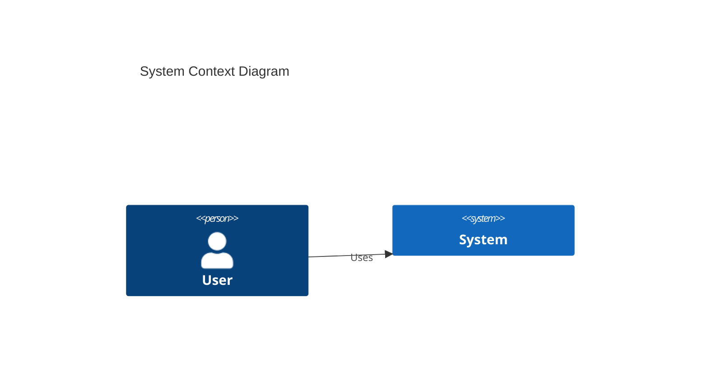
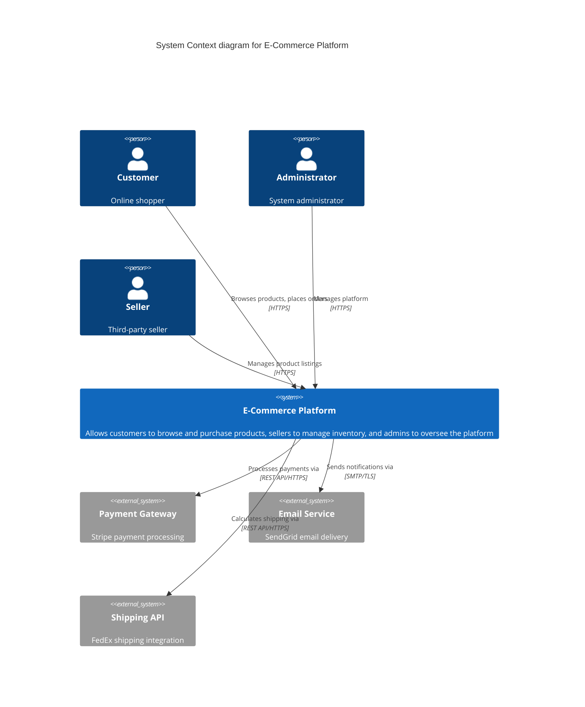
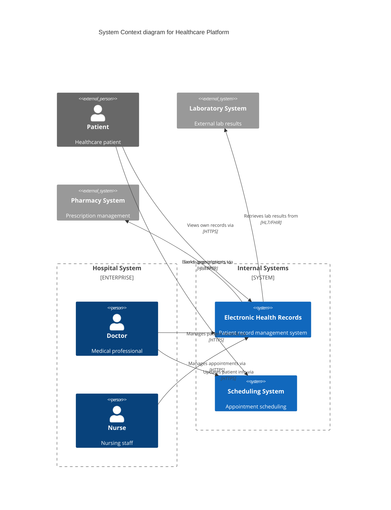
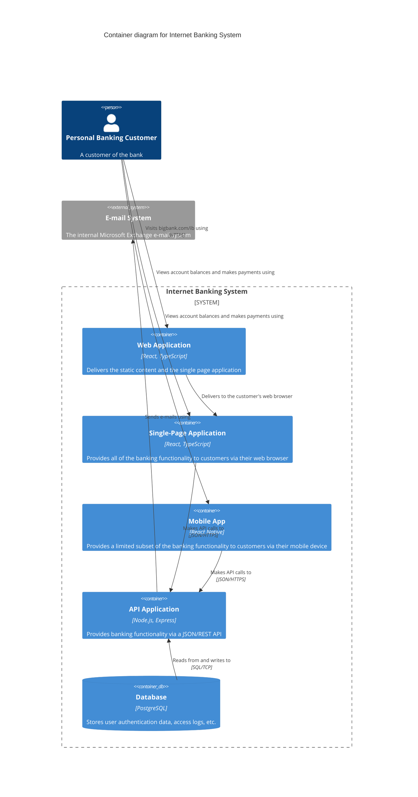
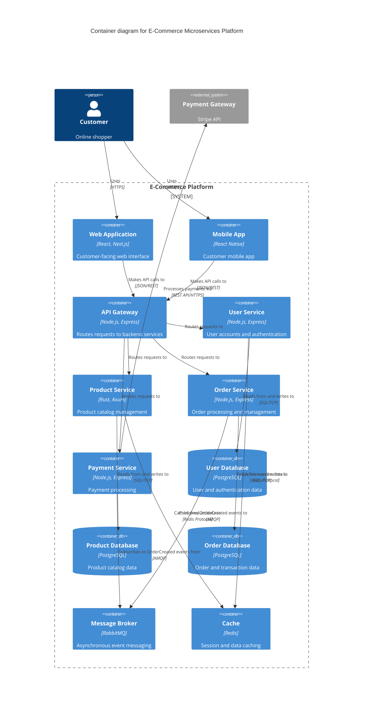
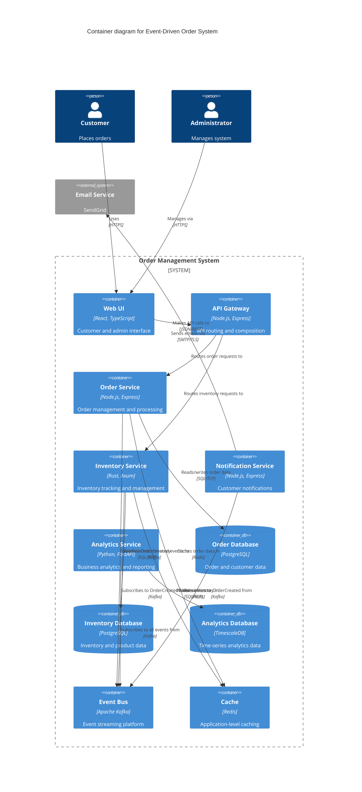
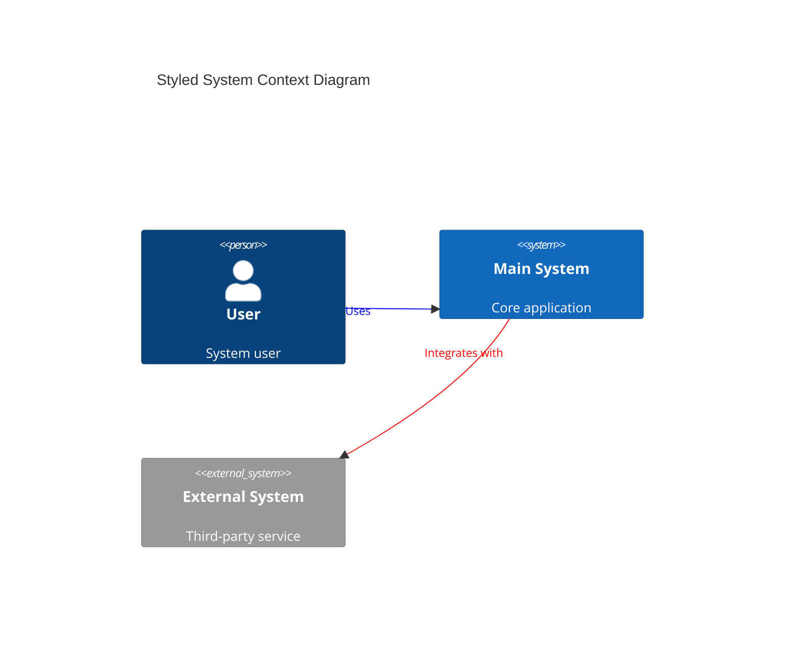
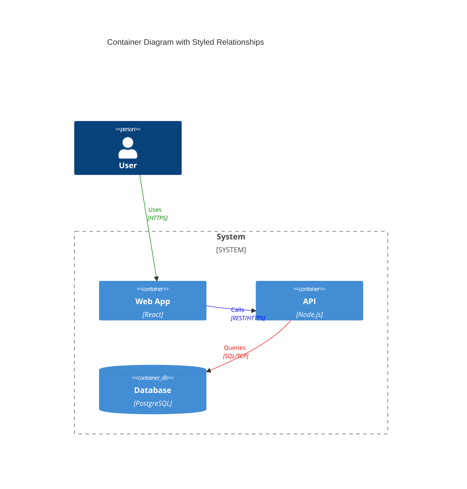
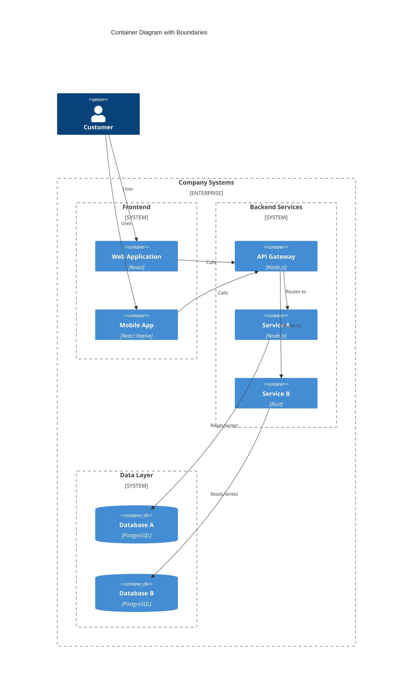
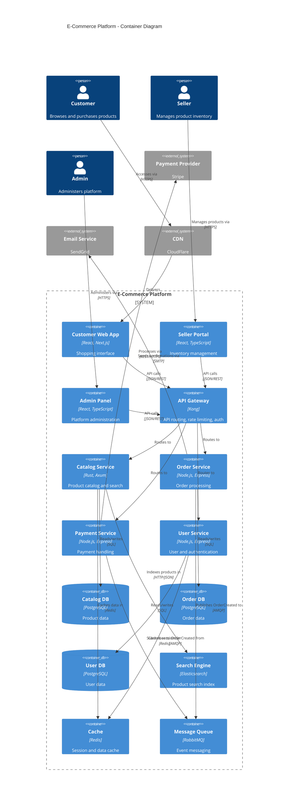

# Mermaid C4 Templates

## Overview

Mermaid provides native C4 diagram support that renders automatically in GitHub, GitLab, and many documentation platforms. This makes it ideal for documentation-first architectures where diagrams live alongside code.

**Advantages**:
- Native GitHub/GitLab rendering
- Simpler syntax than PlantUML
- No external dependencies
- Great for markdown documentation

**Limitations**:
- Less styling control than PlantUML
- Fewer layout options
- Limited to Context and Container diagrams

## Setup

### In Markdown Files

````markdown

````

### Rendering

- **GitHub/GitLab**: Automatic in markdown files
- **VS Code**: Install Mermaid extension
- **Online**: https://mermaid.live/
- **CLI**: `npm install -g @mermaid-js/mermaid-cli`

## Level 1: System Context Templates

### Template 1: Basic System Context

````markdown
```mermaid
C4Context
  title System Context diagram for Internet Banking System

  Person(customer, "Personal Banking Customer", "A customer of the bank, with personal bank accounts.")

  System(banking_system, "Internet Banking System", "Allows customers to view information about their bank accounts, and make payments.")

  System_Ext(mail_system, "E-mail system", "The internal Microsoft Exchange e-mail system.")
  System_Ext(mainframe, "Mainframe Banking System", "Stores all of the core banking information about customers, accounts, transactions, etc.")

  Rel(customer, banking_system, "Views account balances, and makes payments using")
  Rel_Back(customer, mail_system, "Sends e-mails to")
  Rel_Neighbor(banking_system, mail_system, "Sends e-mail using")
  Rel(banking_system, mainframe, "Gets account information from, and makes payments using")

  UpdateElementStyle(customer, $fontColor="white", $bgColor="blue", $borderColor="blue")
  UpdateRelStyle(customer, banking_system, $textColor="blue", $lineColor="blue")
```
````

### Template 2: Multi-Actor System Context

````markdown

````

### Template 3: Enterprise Boundary Context

````markdown

````

## Level 2: Container Templates

### Template 1: Web Application with Backend

````markdown

````

### Template 2: Microservices Architecture

````markdown

````

### Template 3: Event-Driven Architecture

````markdown

````

## Styling and Customization

### Custom Colors

````markdown

````

### Relationship Styling

````markdown

````

### Boundary Grouping

````markdown

````

## Complete Examples

### Example 1: Full Stack E-Commerce

````markdown

````

## Rendering Options

### GitHub/GitLab

Mermaid diagrams render automatically in markdown files:

```markdown
# System Architecture

Our system follows a microservices architecture:

```mermaid
C4Container
  [your diagram here]
```

See the diagram above for details.
```

### VS Code

1. Install "Markdown Preview Mermaid Support" extension
2. Open markdown file with Mermaid diagram
3. Use markdown preview (`Cmd+Shift+V`)

### Command Line

```bash
# Install mermaid-cli
npm install -g @mermaid-js/mermaid-cli

# Render to PNG
mmdc -i diagram.mmd -o diagram.png

# Render to SVG
mmdc -i diagram.mmd -o diagram.svg

# Custom theme
mmdc -i diagram.mmd -o diagram.png -t forest
```

### Online Editor

Visit https://mermaid.live/ for:
- Live preview
- Export to PNG/SVG
- Share diagrams
- Embed in docs

## CI/CD Integration

### GitHub Actions

```yaml
name: Render Mermaid Diagrams

on:
  push:
    paths:
      - 'docs/**/*.mmd'

jobs:
  render:
    runs-on: ubuntu-latest
    steps:
      - uses: actions/checkout@v3

      - name: Setup Node.js
        uses: actions/setup-node@v3
        with:
          node-version: '18'

      - name: Install Mermaid CLI
        run: npm install -g @mermaid-js/mermaid-cli

      - name: Render diagrams
        run: |
          find docs -name "*.mmd" -exec mmdc -i {} -o {}.png \;

      - name: Commit rendered diagrams
        run: |
          git config --local user.email "action@github.com"
          git config --local user.name "GitHub Action"
          git add docs/**/*.png
          git commit -m "Update rendered diagrams" || exit 0
          git push
```

## Best Practices

### DO:
✅ Use Mermaid for documentation-first architectures
✅ Store `.mmd` files alongside markdown docs
✅ Use meaningful titles with `title` keyword
✅ Specify technology stacks in container descriptions
✅ Use System_Boundary for logical grouping
✅ Add relationship labels with protocols
✅ Leverage GitHub's native rendering
✅ Keep diagrams under 30-40 elements for readability

### DON'T:
❌ Use for complex diagrams (PlantUML better for that)
❌ Forget to specify relationship protocols
❌ Mix abstraction levels in single diagram
❌ Use vague relationship labels
❌ Over-style (keep it simple)
❌ Create diagrams wider than readable in GitHub

## Comparison: Mermaid vs PlantUML

| Feature | Mermaid | PlantUML |
|---------|---------|----------|
| **GitHub Rendering** | Native | Requires plugin |
| **Syntax Complexity** | Simple | More complex |
| **Styling Options** | Limited | Extensive |
| **Layout Control** | Auto | More control |
| **C4 Support** | Context, Container | All 4 levels |
| **Learning Curve** | Easy | Moderate |
| **Best For** | Docs, simple diagrams | Complex, detailed |

## Related Resources

- [PlantUML C4 Templates](./plantuml-templates.md) - Alternative with more features
- [Complete C4 Examples](./complete-examples.md) - Full system examples
- [Diagramming Best Practices](./best-practices.md) - General C4 guidance

---

**Resource Coverage**: Complete Mermaid templates for Context and Container levels
**Advantages**: Native GitHub rendering, simple syntax, great for documentation
**Use When**: Documentation-first approach, moderate complexity diagrams
