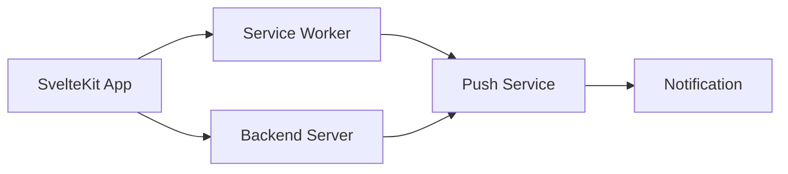

# Push Notifications in SvelteKit PWAs

## Overview

Push notifications enable re-engagement with users even when your PWA isn't open. This guide covers Web Push API implementation, notification handling, and best practices for user experience.

## Architecture Overview



## Server Setup

### Generating VAPID Keys

```bash
# Install web-push library
npm i web-push

# Generate VAPID keys
npx web-push generate-vapid-keys
```

### Backend Implementation (Node.js)

```javascript
// server/push-notifications.js
import webpush from 'web-push';

// Configure with your VAPID keys
webpush.setVapidDetails(
  'mailto:your-email@example.com',
  process.env.VAPID_PUBLIC_KEY,
  process.env.VAPID_PRIVATE_KEY
);

export class PushNotificationService {
  constructor(db) {
    this.db = db;
  }
  
  async saveSubscription(userId, subscription) {
    // Save subscription to database
    await this.db.subscription.upsert({
      where: { userId },
      update: { 
        endpoint: subscription.endpoint,
        keys: subscription.keys,
        expirationTime: subscription.expirationTime
      },
      create: {
        userId,
        endpoint: subscription.endpoint,
        keys: subscription.keys,
        expirationTime: subscription.expirationTime
      }
    });
  }
  
  async sendNotification(userId, payload) {
    const subscription = await this.db.subscription.findUnique({
      where: { userId }
    });
    
    if (!subscription) {
      throw new Error('No subscription found');
    }
    
    const notificationPayload = {
      notification: {
        title: payload.title,
        body: payload.body,
        icon: payload.icon || '/icon-192.png',
        badge: payload.badge || '/badge-72.png',
        vibrate: payload.vibrate || [200, 100, 200],
        data: {
          dateOfArrival: Date.now(),
          primaryKey: payload.id,
          ...payload.data
        },
        actions: payload.actions || []
      }
    };
    
    try {
      await webpush.sendNotification(
        subscription,
        JSON.stringify(notificationPayload)
      );
      return { success: true };
    } catch (error) {
      if (error.statusCode === 410) {
        // Subscription expired
        await this.db.subscription.delete({
          where: { userId }
        });
      }
      throw error;
    }
  }
  
  async sendBroadcast(payload) {
    const subscriptions = await this.db.subscription.findMany();
    
    const results = await Promise.allSettled(
      subscriptions.map(sub => 
        this.sendNotification(sub.userId, payload)
      )
    );
    
    return {
      sent: results.filter(r => r.status === 'fulfilled').length,
      failed: results.filter(r => r.status === 'rejected').length
    };
  }
}
```

### API Endpoints

```javascript
// src/routes/api/push/subscribe/+server.js
import { json } from '@sveltejs/kit';
import { PushNotificationService } from '$lib/server/push';

export async function POST({ request, locals }) {
  if (!locals.user) {
    return json({ error: 'Unauthorized' }, { status: 401 });
  }
  
  const subscription = await request.json();
  const pushService = new PushNotificationService();
  
  try {
    await pushService.saveSubscription(locals.user.id, subscription);
    return json({ success: true });
  } catch (error) {
    return json({ error: error.message }, { status: 500 });
  }
}

// src/routes/api/push/send/+server.js
export async function POST({ request, locals }) {
  if (!locals.user?.isAdmin) {
    return json({ error: 'Unauthorized' }, { status: 401 });
  }
  
  const { userId, title, body, data } = await request.json();
  const pushService = new PushNotificationService();
  
  try {
    await pushService.sendNotification(userId, {
      title,
      body,
      data
    });
    return json({ success: true });
  } catch (error) {
    return json({ error: error.message }, { status: 500 });
  }
}
```

## Client Implementation

### Push Manager Store

```javascript
// lib/stores/push-notifications.js
import { writable, derived } from 'svelte/store';
import { browser } from '$app/environment';

function createPushStore() {
  const { subscribe, set, update } = writable({
    supported: false,
    permission: 'default',
    subscription: null,
    error: null
  });
  
  async function initialize() {
    if (!browser) return;
    
    const supported = 
      'serviceWorker' in navigator && 
      'PushManager' in window &&
      'Notification' in window;
    
    if (!supported) {
      set({
        supported: false,
        permission: 'denied',
        subscription: null,
        error: 'Push notifications not supported'
      });
      return;
    }
    
    const permission = Notification.permission;
    
    // Get existing subscription
    const registration = await navigator.serviceWorker.ready;
    const subscription = await registration.pushManager.getSubscription();
    
    set({
      supported: true,
      permission,
      subscription,
      error: null
    });
  }
  
  async function requestPermission() {
    if (!browser || Notification.permission === 'granted') return true;
    
    const permission = await Notification.requestPermission();
    update(s => ({ ...s, permission }));
    
    return permission === 'granted';
  }
  
  async function subscribe() {
    const granted = await requestPermission();
    if (!granted) {
      update(s => ({ 
        ...s, 
        error: 'Permission denied' 
      }));
      return false;
    }
    
    try {
      const registration = await navigator.serviceWorker.ready;
      
      // Get public key from server
      const response = await fetch('/api/push/vapid-public-key');
      const { publicKey } = await response.json();
      
      const subscription = await registration.pushManager.subscribe({
        userVisibleOnly: true,
        applicationServerKey: urlBase64ToUint8Array(publicKey)
      });
      
      // Save subscription to server
      await fetch('/api/push/subscribe', {
        method: 'POST',
        headers: {
          'Content-Type': 'application/json'
        },
        body: JSON.stringify(subscription)
      });
      
      update(s => ({ 
        ...s, 
        subscription,
        error: null 
      }));
      
      return true;
    } catch (error) {
      update(s => ({ 
        ...s, 
        error: error.message 
      }));
      return false;
    }
  }
  
  async function unsubscribe() {
    const registration = await navigator.serviceWorker.ready;
    const subscription = await registration.pushManager.getSubscription();
    
    if (!subscription) return true;
    
    try {
      await subscription.unsubscribe();
      
      // Remove from server
      await fetch('/api/push/unsubscribe', {
        method: 'POST',
        headers: {
          'Content-Type': 'application/json'
        },
        body: JSON.stringify({ endpoint: subscription.endpoint })
      });
      
      update(s => ({ 
        ...s, 
        subscription: null 
      }));
      
      return true;
    } catch (error) {
      update(s => ({ 
        ...s, 
        error: error.message 
      }));
      return false;
    }
  }
  
  return {
    subscribe,
    initialize,
    requestPermission,
    subscribeToNotifications: subscribe,
    unsubscribe
  };
}

export const pushNotifications = createPushStore();

// Helper function
function urlBase64ToUint8Array(base64String) {
  const padding = '='.repeat((4 - base64String.length % 4) % 4);
  const base64 = (base64String + padding)
    .replace(/\-/g, '+')
    .replace(/_/g, '/');
  
  const rawData = window.atob(base64);
  const outputArray = new Uint8Array(rawData.length);
  
  for (let i = 0; i < rawData.length; ++i) {
    outputArray[i] = rawData.charCodeAt(i);
  }
  
  return outputArray;
}
```

### UI Component

```svelte
<!-- lib/components/PushNotificationPrompt.svelte -->
<script>
  import { pushNotifications } from '$lib/stores/push-notifications';
  import { onMount } from 'svelte';
  
  let showPrompt = false;
  let loading = false;
  
  onMount(async () => {
    await pushNotifications.initialize();
    
    // Show prompt if supported but not subscribed
    if ($pushNotifications.supported && 
        !$pushNotifications.subscription &&
        $pushNotifications.permission !== 'denied') {
      // Delay prompt for better UX
      setTimeout(() => {
        showPrompt = true;
      }, 5000);
    }
  });
  
  async function enableNotifications() {
    loading = true;
    const success = await pushNotifications.subscribeToNotifications();
    loading = false;
    
    if (success) {
      showPrompt = false;
      showSuccessMessage();
    }
  }
  
  function showSuccessMessage() {
    // Show temporary success message
    const message = document.createElement('div');
    message.className = 'notification-success';
    message.textContent = '🔔 Notifications enabled!';
    document.body.appendChild(message);
    
    setTimeout(() => {
      message.remove();
    }, 3000);
  }
</script>

{#if showPrompt}
  <div class="notification-prompt">
    <div class="prompt-content">
      <h3>🔔 Stay Updated!</h3>
      <p>Get notified about important updates and new features.</p>
      
      <div class="prompt-actions">
        <button 
          on:click={enableNotifications}
          disabled={loading}
          class="enable-btn"
        >
          {loading ? 'Enabling...' : 'Enable Notifications'}
        </button>
        
        <button 
          on:click={() => showPrompt = false}
          class="later-btn"
        >
          Maybe Later
        </button>
      </div>
    </div>
  </div>
{/if}

<!-- Settings Component -->
{#if $pushNotifications.subscription}
  <div class="notification-settings">
    <h4>Notification Settings</h4>
    <label>
      <input 
        type="checkbox" 
        checked={true}
        on:change={async (e) => {
          if (!e.target.checked) {
            await pushNotifications.unsubscribe();
          }
        }}
      />
      Push Notifications Enabled
    </label>
  </div>
{/if}

<style>
  .notification-prompt {
    position: fixed;
    bottom: 20px;
    right: 20px;
    background: white;
    border-radius: 8px;
    padding: 1.5rem;
    box-shadow: 0 4px 6px rgba(0, 0, 0, 0.1);
    max-width: 350px;
    z-index: 1000;
    animation: slideUp 0.3s ease;
  }
  
  @keyframes slideUp {
    from {
      transform: translateY(100%);
      opacity: 0;
    }
    to {
      transform: translateY(0);
      opacity: 1;
    }
  }
  
  .prompt-actions {
    display: flex;
    gap: 1rem;
    margin-top: 1rem;
  }
  
  .enable-btn {
    background: #4F46E5;
    color: white;
    border: none;
    padding: 0.5rem 1rem;
    border-radius: 4px;
    cursor: pointer;
  }
  
  .later-btn {
    background: transparent;
    border: 1px solid #ccc;
    padding: 0.5rem 1rem;
    border-radius: 4px;
    cursor: pointer;
  }
  
